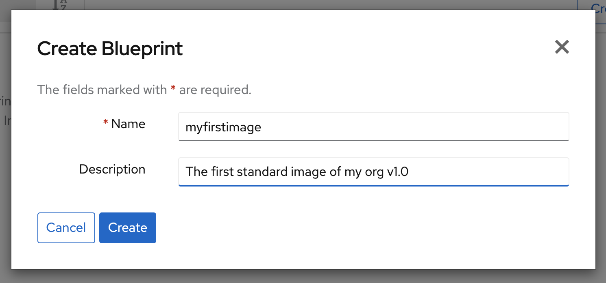
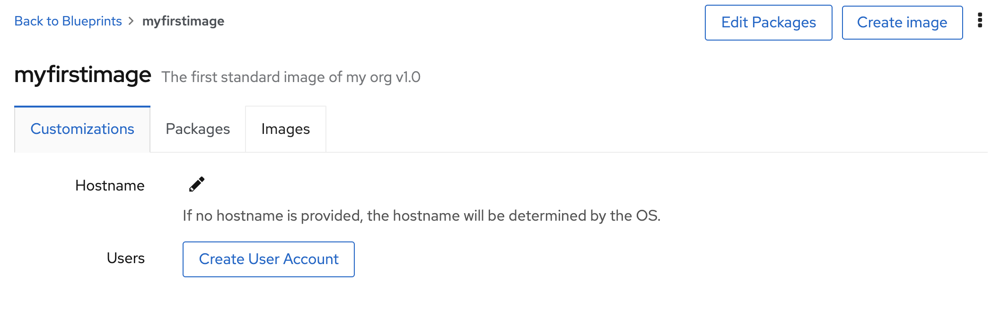
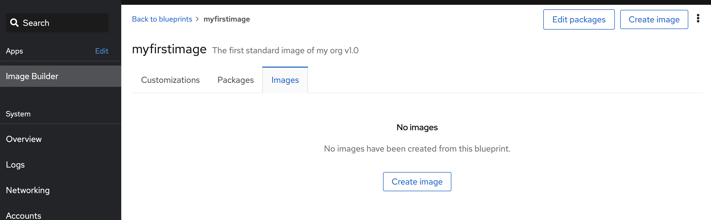
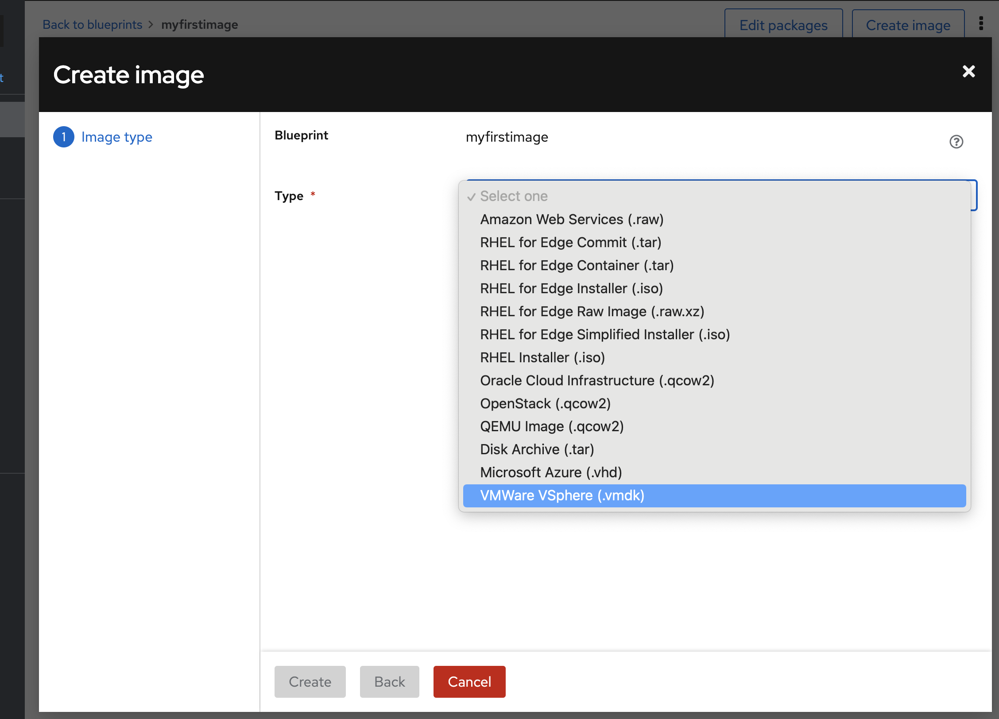
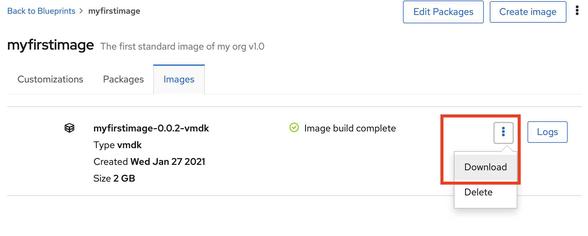

# Create image for use in the cloud or virtual

We know that installation of systems will be part of your tasks in the future. And using virtual or cloud you will want some kind of template for your systems that include settings and customizations. Templates make for rapid deployment since we are skipping the install process of the operating system. However inherent to templates is age. As soon as you have created a new template it is outdated. So by using the image builder you get a dependable and reproducable process that always creates the same template, just updated packages.


## Create a "golden image" using image builder
To start this out we need to add the image builder application. This is done at the Applications part of the menu on your left.
Locate the **Image Builder** entry and install it. It may alresdy be installed

So now click on the image to goto the image builder it is located below the image for the system we are using.


Once here you see the interface, there is already a few examples installed


So now its time to make a new image, this is done by creating a new **Blueprint** see the button in the top right corner? Press it.



Give your image a good name and perhaps a description of what is included or what purpose the image has.

In the filter field on your left side you can type a name of a package like bash-completion.


Once you press the plus-sign next to the package name in the left column it is added to the image that is on your right. Now when we add a package all dependencies of that package is also added. This is shown also in the interface:


So now lets add some more packages that will make the image more useful.

We will need subscription-manager to be able to attach our subscriptions. Also openssh-server and openssh-clients will make the image much more usable since ssh is used to connect to the server remotely.

Add this list of packages:

```
firewalld
openssh-clients
openssh-server
passwd
plymouth
rhn-client-tools
rhn-setup
rpm
rsyslog
selinux-policy-targeted
subscription-manager
sudo
systemd
yum
```
Once that is done please press the blue **Commit** button once and get a review of you selections. Again press the blue **Commit** button to return to the list of images.

## Add local users to the golden image

Now if you click the name of your image:


You will get another view at the image. This is where you can add users and such to the image.



Now lets add a user, click the Create User Account button


Fill any details you like here. 

## Create image for your selected hypervisor

Once the image is done it is time to use it on your selected hypervisor. Now in the same detailed view of your image you will find a tab called Images. Please click that one now.



And click the button Create Image



Here you will find all available image-formats that is supported out of the box. Just select the kind of hypervisor you are targeting and then click Create. Now the image is beeing built and you can follow the process by clicking on the link **Show Logs**


Once the buildprocess is done you can download your image. Press the Download button to save it to disk




Continue to [assignment 2](assign2.md)

Back to [index](thews.md)