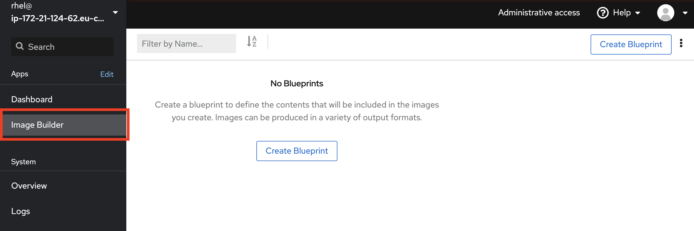
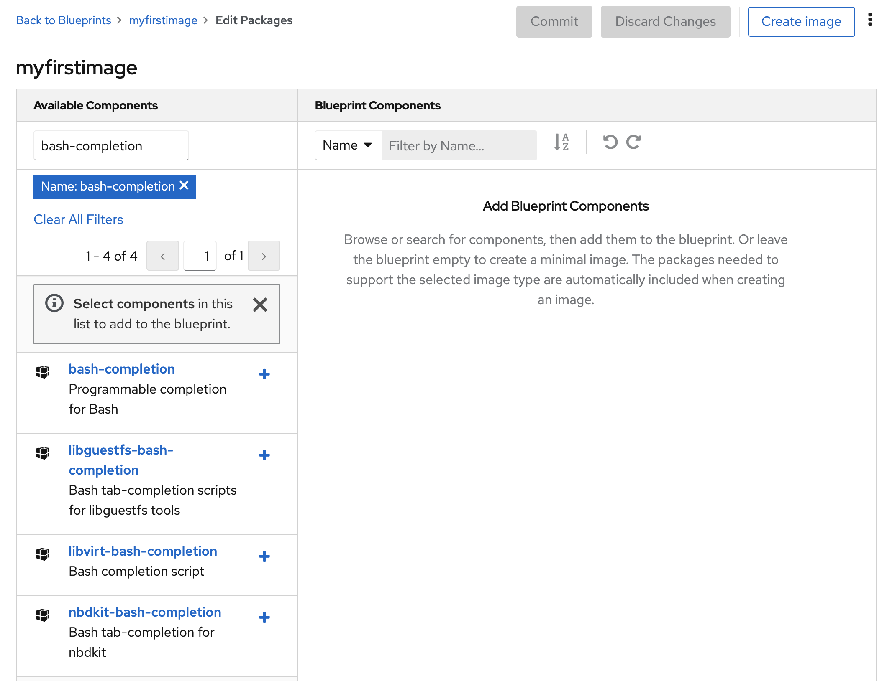

# Create image for use in the cloud or virtual

Installing systems is still a common task when managing Linux systems. There are many different ways to install Linux, the most common one in virtual and cloud environments is using an image or so called template for your Linux operating system. The template will typically include a majority of the software and configuration which you need - preinstalled into an image.   


Templates make for rapid deployment since we are skipping the install process of the operating system. However templates have an inherent problem, which is aging. As an template is a snapshot, soon after you have created a new template, it is outdated. The solution to this is ofcourse automation of the creation process for the template. Thhis is something we can do using the ```image builder``` functionality included in Red Hat Enterprise Linux.

By using the ```image builder```, you get a dependable and reproducable process that always creates the same template, containing the newest updated packages at each build.

## Create a "golden image" using image builder
To start this out we need to add the image builder application. This is done at the ```Applications``` part of the menu on your left.

:boom: Locate the **Image Builder** entry and install it if it is not already installed.

:boom: To access the ```image builder```, you need to go the the furthest left on the left side menu and select ```Image Builder``` as shown below.



:boom: Once you access the interface, you may be asked to enable the Lorax service, do so if asked.

Once here you see the interface, there is already a few examples installed.


:boom: Now its time to make a new image, this is done by creating a new **Blueprint**. See the button in the top right corner which reads  ```Create Blueprint```? Click it.


Give your image a good name and perhaps a description of what is included or what purpose the image has.

In the filter field on your left side you can type a name of a package like bash-completion.



Once you press the plus-sign next to the package name in the left column it is added to the image that is on your right. Now when we add a package all dependencies of that package is also added. This is shown also in the interface:


:boom: So now lets add some more packages that will make the image more useful.

We will need subscription-manager to be able to attach our subscriptions. Also openssh-server and openssh-clients will make the image much more usable since ssh is used to connect to the server remotely.

Add this list of packages:

```
bash-completion
firewalld
openssh-clients
openssh-server
subscription-manager
```
Once that is done please press the blue **Commit** button once and get a review of you selections. Again press the blue **Commit** button to return to the list of images.

## Add local users to the golden image

:boom: Now if you click the name of your image:


You will get another view at the image. This is where you can add users and such to the image.


:boom: Now lets add a user, click the Create User Account button


Fill any details you like here. 

## Create image for your selected hypervisor

Once the image is done it is time to use it on your selected hypervisor. Now in the same detailed view of your image you will find a tab called Images. Please click that one now.


:boom: And click the button Create Image


Here you will find all available image-formats that is supported out of the box. Just select the kind of hypervisor you are targeting and then click Create. Now the image is beeing built and you can follow the process by clicking on the link **Show Logs**


Once the buildprocess is done you can download your image. Press the Download button to save it to disk


Continue to [assignment 2](assign2.md)

Back to [index](thews.md)