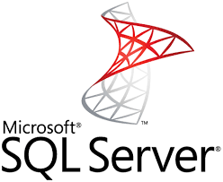

# Installing Microsoft SQL on Red Hat Enterprise Linux

Yes this can be done. And it is fully supported. And even a little bit faster perfomance.



But the SQL Server Management Studio is still windows only. There are some command line interface to to stuff with the SQL server.

## Install repo that contains MSSQL

So first of all we need to install the repo definition that allows the yum command to know where to fetch the install files from. This is done in the terminal.

:boom: So please click the Terminal in the left side menu.
```
sudo curl -o /etc/yum.repos.d/mssql-server.repo https://packages.microsoft.com/config/rhel/8/mssql-server-2019.repo
```

What this command does is to create a file in the location that the software management system looks to find enabled repositories.

:boom: Now run this command
```
sudo ls -l /etc/yum.repos.d/
```
Which outputs something like this:
```
-rw-r--r--. 1 root root    231 Jan 24 14:22 mssql-server.repo
-rw-r--r--. 1 root root 130564 Jan 24 08:00 redhat.repo
```
As you can see from the list above there is two files (at least) an one is named **mssql-server.repo** so this file contains the settings needed to install software from microsoft.


## Install MSSQL binaries from the repo

Now its time to install the MSSQL server. This is also done using the terminal.

:boom: So input this command:
```
sudo yum install mssql-server
```

Type Yes and the stuff needed is installed. Ýou will get a 
```
Complete!
```

When the installation is done it is time to configure the SQL server with the SA password and such.

:boom: Run this command and follow the instructions:
```
sudo /opt/mssql/bin/mssql-conf setup
```

## Set MSSQL service to start at boot

You can now use the services part of the menu to your left to setup the service to be **Enabled** which will then start the MSSQL server at boot. Once you have enabled reboot the machine to make sure you have setup correctly

## Open firewall for correct port

And you will use the firewall part from the Networking menu on your left to open the port for MSSQL
```
port=1433
```


Continue to [assignment 3](assign3.md)

Back to [index](thews.md)