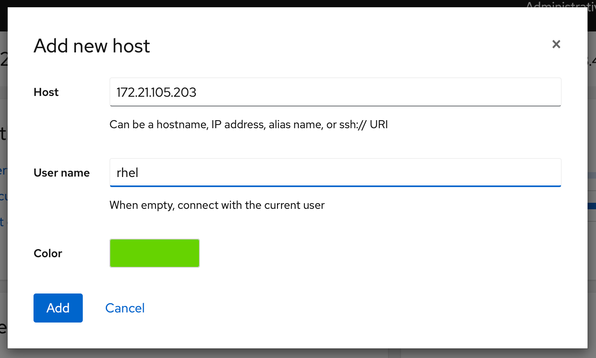
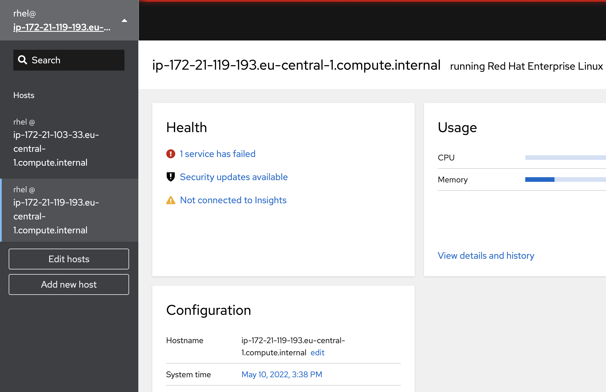
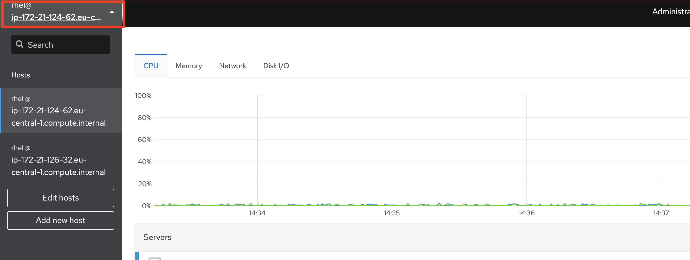

# Management of several servers using Cockpit

Yes it is possible to manage several servers with one cockpit instance. Lets start to set this up

## Create a ssh key to use for authentication

So we want to be able to manage those other servers without entering passwords and such. So we are going to generate a ssh key-pair to use for the authentication. This needs to be done from the terminal. So lets go there. Locate terminal in the menu on your left.

Once there we are going to use an already installed application to generate the keys.
```
ssh-keygen -t rsa -b 2048
```
Just press enter to accept defaults. We input no password since then we would need to use a password anyway to unlock the key.

This command will generate an RSA key with a key length of 2048 bits. This for added security.

## Distribute the ssh key to the servers to be managed

Now when we have the key generated we need the public part of the key to add to the servers that we are going to manage. 
```
cat .ssh/id_rsa.pub
```
Which will output something like this:
```
ssh-rsa AAAAB3NzaC1yc2EAAAADAQABAAABAQDSCAXaZu7Bz4eSs/zyRi1MB1Nm7oR5XXBkjvbhpDdszPkUouDk+2MJ6/nK19NEtJ1yGU6t02kPQLTq6aOvUaPZsQ+wXFL3qPWhxSb60Tbc/t1+Nhh9FfeIQO+cqzq4PtCkC7DThSjParCkmkTn5JnIYNaVvOimaI9c4lO0qrt+6kdty2oTIbdcOrM0CERDBWhzECCmCDpAXv6R4/G+g2WXTXefpmGgwEdNiDVfV79niJQj4DnG0DVQV/uFNKoV/AyzGcKFVNzaO7PSqoY5kdQjlAEa3tr2SETLH8jjSec7ux4BDoAyPU+qNLWTCHNnlZ6yB4isbPbKw5RcOaDnZiLr rhel@linux4win
```
We are interested in the long string between *ssh-rsa* and *rhel@hostname*. This string can be used to authenticate password-less from this server to that other server. 

Now we are going to send this key to another server. For this you need the ip of the server or the FQDN. 
```
ssh-copy-id 192.168.121.214
```
When promted input the password of user rhel(redhat)

## Add servers to the graphical user interface(GUI)

Now it is time to add the second server to the user interface. Locate the **Dashboard** icon on your very left and click on that:


Once you click on that button you will see the Dashboard:


If all is well you can add servers from here. Please press the **plus** sign to add another server.



In the end the list should look something like this:



## Perform tasks on many servers using the GUI

Now it is time to do some stuff on the other machine. And it is as simple as clicking the new server in the interface to go there. Now you need to click around to fix stuff.

You can always go between the servers by clicking in the top left corner



So I suggest enrolling the server in the domain, make sure the server is updated to latest patch level and perhaps you will find other stuff to do with the second one.

Continue to [assignment 4](assign4.md)

Back to [index](../README.md)