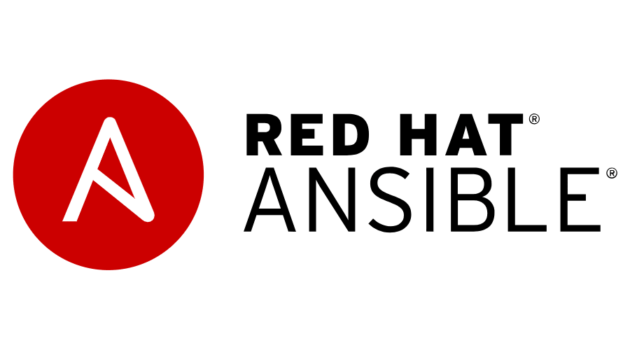

# Management of several servers using Ansible

In the previous assignment you added an additional server to the ```Web console```. This enabled you to manage two servers using the web console. In this chapter, you will get introduced to the worlds currently most popular automation framework, Ansible.

## Intro to Ansible

If you are handling dussins of servers, doing things such as installing software and changing configuration quickly becomes a cumbersome tasks which will require more people to manage the systems while also affecting time-to-deliver for the various tasks.

To handle a larger amount of systems, you will need to adapt an automation framework to handle the previously mentioned challenges.

There are many automation frameworks out there, such as Puppet, Chef and Salt. The currently most popular automation framework in the world is called Ansible.



The reason why Ansible has risen to popularity, is it's lower adoption threshhold (automation is pretty close to written language) and it's clientless nature (you do not have to install anything on a system to automate it). Ansible's clientless nature underpins Ansible's ability to automate all things, including all current Operating Systems, network equipment and even IoT devices such as lightbulbs. 

:thumbsup: When implementing Ansible in an enterprise on a larger scale, you will need some type of management solution to solve collaborative and security related challenges, such as ```Red Hat Ansible Tower```, or it's upstream open source project, ```AWX```. We will not cover that in this lab, but only focus on some quick hands on experience.

## Setup of ansible master

We will choose our first (where we have spend most of our time on, so far) Red Hat Enterprise Linux server as an Ansible master, the server which we'll do Ansible automation from.

:boom: To start, we will install the ansible software needed. In the ```web console```, go to that server, open the ```Terminal``` and install the required software.
```
sudo dnf install ansible
```

:boom: Once it is installed please verify that it works by running this command:
```
ansible --version
```

Now you are ready to add some servers to be managed. This is done by createing a host file. It can be stored anywhere and is in its simplest form a list of ip-addresses or FQDN's.

:boom: We are going to edit the default host file that is located here:
```
/etc/ansible/hosts
```

If you look into this file you will see lots of good instuctions:
```
less /etc/ansible/hosts
```

:boom: To exit less you press the **Q** button. So this information is good to shave for the future. Lets make a copy of that file
```
sudo cp /etc/ansible/hosts /etc/ansible/hosts.backup
```

:boom: So now we have a backup file we can lookup if needed. Now it is time to fill the file with simple context. Type below commands to put your Red Hat Enterprise Linux server into the inventory file:
```
sudo su -
echo "ip.address.of.linuxserver1" >/etc/ansible/hosts
echo "ip.address.of.linuxserver2" >>/etc/ansible/hosts
```

:exclamation: Please note the double ```>>``` on the last line there.

## Run ad hoc commands against your linux servers

:boom: Now it is possible to do stuff on both (but this can be a looooong list of servers) servers in one go. Lets start by verifying that we can connect by this command
```
ansible all -m ping -u rhel --ask-pass
```

:boom: Next up lets run a command on the servers:
```
ansible all -m shell -a 'cat /etc/redhat-release' -u rhel --ask-pass --become-user rhel
```

:boom: With this command we find out what release of Red Hat Enterprise Linux these servers are running. Imagine this beeing a loooooong list of servers. You now have some insights into you entire fleet just using one command that you can alter indefinite. So lets just update stuff.
```
ansible all -m shell -a 'dnf check-update' -u rhel --ask-pass --become-user rhel
```

:boom: This command list all available updates for any system. Now most likely you do not get any updates since we have already done the patching using the web-ui. But if there where any all you needed to do was run this command.
```
ansible all -m shell -a 'dnf update -y' -u rhel --ask-pass --become-user rhel
```

Once the command is done you have patched two servers using one command.

## Run ad hoc commands against your windows server

Now lets see if we can do this also with our windows server. On the server we do not have to do anything it is already prepared for ansible management. Here you find info about what was done to enable this:

[Windows server setup](https://docs.ansible.com/ansible/latest/user_guide/windows_setup.html)

Now we need to add some stuff to the hosts file in order to be able to manage windows servers.

:boom: So lets edit the hosts file again:
```
/etc/ansible/hosts
```
:boom: And add all of these lines somewhere
```
[win]
ip.address.of.winserver1

[win:vars]
ansible_user=.\wsadder
ansible_password=Password1
ansible_connection=winrm
ansible_winrm_transport=ntlm
ansible_winrm_server_cert_validation=ignore
```

What we did was add a group [win] and some variables for that group [win:vars]
I know it is not the safest to have password in clear text. To make it safer you can use ansible-vault.

:boom: Once you have added the stuff to the hosts file it is time to test if stuff works:

```
ansible win -m win_ping
```

You should get some kind of result indicating that you can connect to the remote windows server.

:boom: If that is successful then perhaps lets make some very common tasks like check for updates using Microsoft Updates. Be prepared that it may take quite some time to get back the list
```
ansible win -m win_updates -e state=searched
```

:boom:  Now we see that there are some updates to lets install them
```
ansible win -m win_updates -e category_names=['SecurityUpdates, CriticalUpdates, UpdateRollups'] -e reboot=yes
```

:boom: If you need to reboot the win server use this command
```
ansible win -m win_reboot
```

Back to [index](thews.md)

