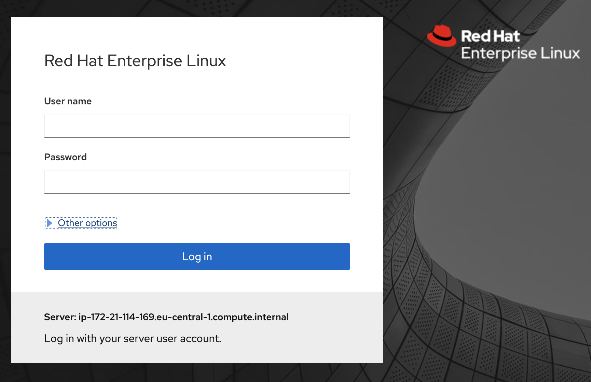
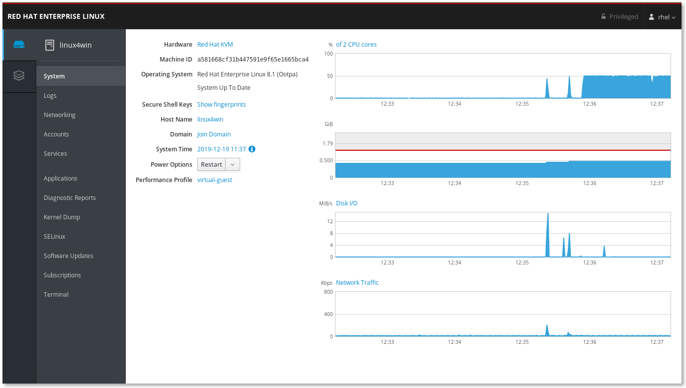

# Requirements
* A computer with a connection to the Internet.
* A cockpit supported browser (Firefox, Chrome or Microsoft Edge).

# Your environment
Your instructor will provide a list of ip-addresses to use during the day. Locate the ip named **Start here** and open a web-browser. Input like this:
```
https://ip.nu.mb.er:9090
```
Now that you have connected to your server it is time to log into the web-ui called cockpit.

Use the user **rhel** and password that your instructor sent.

Make sure you check the checkbox labeld "Reuse my password for privileged tasks" when you log in. This resuses the admin rights of the user for privileged tasks.



This is the first page of the user interface of cockpit:



To your left there is a bar with "applications" as those are known. As you can see there is already quite many.

Some of these are installed as regular packages, the storage package is installed using yum (dnf)

```
yum install cockpit-storaged
```
This can be done also from cockpit (we will look at this in lab 1)

Continue to [lab 1](lab1.md)

Back to [index](thews.md)
