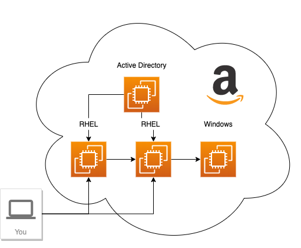

# Welcome to the lab

Hello and welcome to the lab. First off, if you are not familiar to Linux, do not worry, you will be soon. Knowing the Linux operating system is not a prerequisite for this lab, with that said, if you do notice something that you simply do not understand that is a bug which you should report.

Today, the Linux operating system is used to run everything from modern cars to Satellites, IoT devices, core network parts of the internet, major internet services such as search engines, social networks and more. Modern innovative companies such as Google, Facebook, LinkedIn, Netflix, Spotify and Amazon are all founded and built on Open Source technology, including Linux.

This means that the knowledge you'll get today will be widely applicable to a large number of technical sectors and domains.

This lab is meant to get you a hands on start with Linux and does not deal with all theory around the operating system as such.

# Lab graphics

In this lab, we use some basic graphics to make the lab easier to understand. Such as:

:boom: This is something which you have to do.
:star: If you have time, you can also do this.
:exclamation: Take careful notice of this, or you may fall on your face.
:thumbsup: This text contains information about a best practice.
```
Here is some code that you need to run
```
```
Here is an example of expected output when running commands
```

# :exclamation: If something goes wrong
If by some reason you get stuck in a lab - then here's what you should do. **Follow below steps 1-5**. _Do not skip any steps if not told to._

1. If you do not understand what to do in a lab, or do not understand what you are doing, skip immediately to step 5. Also, the authors of this lab apologize for that. The purpose of this lab is so that everyone can do it and understand it.
2. This lab has seen plenty of use, so chances are that you have simply not followed the lab instructions. Start by reading the lab instructions again, carefully.
3. If you are sure that you are doing things as described in the labs, perhaps you typed something wrong or had a copy-paste accident. Double checking your files content and comparing them with the content described here in the lab. If you typed things manually, try doing a clean copy-paste from the lab page instead.
4. Ask the person beside you if that person also had an issue with what you are doing. If so, that may indicate there is actually something wrong.
5. Raise your hand and someone will come and help you :)

# Preparations to do the lab

:boom: Get the following things in order:
* A computer with a connection to the Internet.
* One of the supported browsers: Firefox, Chrome or Microsoft Edge.

# Your environment

Here is a view of your lab-environment:

There are two servers which runs Red Hat Enterprise Linux and two servers running Microsoft Windows, one of the Windows servers provides an Active Directory services.



:exclamation: Your instructor will provide a list of ip-addresses and user credentials to use during the day.

# Accessing your environment

From the list provided by the instructor, locate the address labeled **Start here** and open a web-browser. 

:boom: Input the address, into your web browser like such:
```
https://ip.nu.mb.er:9090
```
Now that you have connected to your server it is time to log into the web-ui called cockpit.

Use the user **rhel** and password that your instructor provided to you.

Make sure you check the checkbox labeld "Reuse my password for privileged tasks" when you log in. This resuses the admin rights of the user for privileged tasks.


This is the first page of the user interface of cockpit:


You are now ready to start.

Continue to [lab 1](lab1.md)

Back to [index](thews.md)
