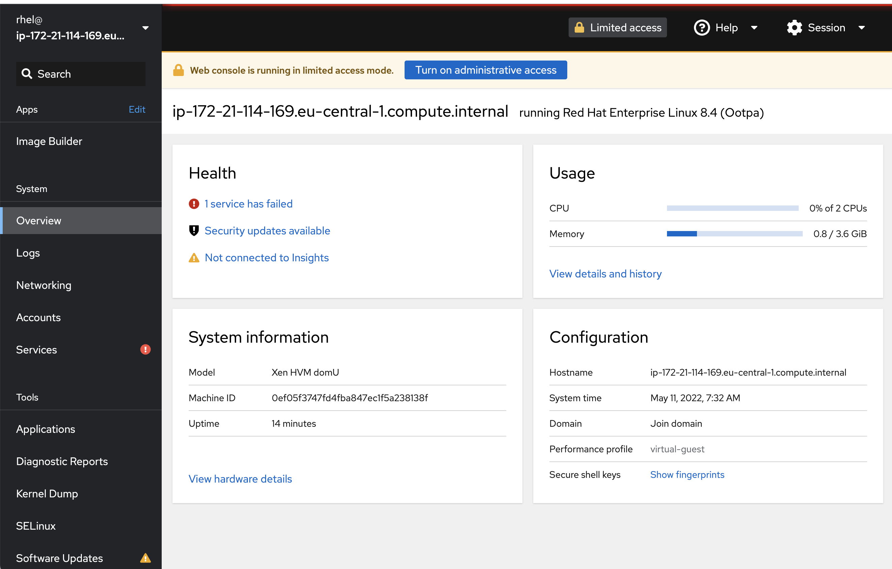

# Welcome to the lab

Hello and welcome to the lab. First off, if you are not familiar to Linux, do not worry, you will be soon. Knowing the Linux operating system is not a prerequisite for this lab, with that said, if you do notice something that you simply do not understand that is a bug which you should report.

```This lab focuses on Red Hat Enterprise Linux, the currently most used enterprise Linux operating system. Many things you'll learn here though, will be possible to apply to other Linux operating systems.```

Today, the Linux operating system is used to run everything from modern cars to Satellites, IoT devices, core network parts of the internet, major internet services such as search engines, social networks and more. Modern innovative companies such as Google, Facebook, LinkedIn, Netflix, Spotify and Amazon are all founded and built on Open Source technology, including Linux. This means that a lot of cutting edge technologies only works on Linux or becomes available there first. Linux is also used at a majority of the worlds largest companies, as this was what most companies migrated to when they moved away from UNIX and mainframe systems.

This all means that the knowledge you'll get from lab will be widely applicable to a large number of technical sectors and domains.

This lab is meant to get you a hands on start with Linux and does not deal with all theory and details around the operating system as such.

# Lab graphics

In this lab, we use some basic graphics to make the lab easier to understand. Such as:

:boom: This is something which you have to do.

:star: If you have time, you can also do this.

:exclamation: Take careful notice of this, or you may fall on your face.

:thumbsup: This text contains information about a best practice.
```
Here is some code that you need to run
```
```
Here is an example of expected output when running commands
```

# :exclamation: If something goes wrong
If by some reason you get stuck in a lab - then here's what you should do. **Follow below steps 1-5**. _Do not skip any steps if not told to._

1. If you do not understand what to do in a lab, or do not understand what you are doing, skip immediately to step 5. Also, the authors of this lab apologize for that. The purpose of this lab is so that everyone can do it and understand it.
2. This lab has seen plenty of use, so chances are that you have simply not followed the lab instructions. Start by reading the lab instructions again, carefully.
3. If you are sure that you are doing things as described in the labs, perhaps you typed something wrong or had a copy-paste accident. Double checking your files content and comparing them with the content described here in the lab. If you typed things manually, try doing a clean copy-paste from the lab page instead.
4. Ask the person beside you if that person also had an issue with what you are doing. If so, that may indicate there is actually something wrong.
5. Raise your hand and someone will come and help you, if this is a teacher lead lab :)

# Preparations to do the lab

:boom: Take a deep breath. This is about you learning, it's not a competition about who finishes the most things or who finishes tasks the fastest. Take your time and read through the instructions and texts - that way you will learn more.

:boom: Get the following things in order:
* A computer with a connection to the Internet.
* One of the supported browsers: Firefox, Chrome or Microsoft Edge.

# :exclamation: Your powers and breaking things
You have complete administrator access in your systems. This is so that you are free to explore your systems fully. 

With that said, if you do not properly read all the instructions or if you do things which you do not fully understand - it is ```very easy``` to break your system. If you do that, your lab instructor look upon you in a judging manner.

Also, **if you break your system, you get to keep all the pieces.** 

# Your environment

Here is a view of your lab-environment:

There are two servers which runs Red Hat Enterprise Linux and two servers running Microsoft Windows, one of the Windows servers provides an Active Directory services, they are all located on the same network and can all reach each other.


:exclamation: Your instructor will provide a list of ip-addresses and user credentials to use during the day.

# Accessing your environment using the Web console

To get access to the Red Hat Enterprise Linux machines, we will use a feature called ```Web console``` which is an application that provides a web based interface to a Linux machine. The application uses the native interfaces of Linux to display information and provide management capabilities in a focused web environments. This is very useful, as you do not have to install a full graphical environment on your Linux servers to be able to manage them. People will often associate Linux with complicated commands run in terminals, but you will soon learn that you can do a lot in a more familiar graphical environment.

:star: If you want to learn more about the ```Web console``` software, the open source project which ```Web console``` is based on, is called ```Cockpit```. [Click here to visit Cockpit's home on the www (https://cockpit-project.org).](https://cockpit-project.org "Cockpit webpage")  

Now, let's log in to your first Red Hat Enterprise Linux server.

:boom: From the list provided by the instructor, locate the address labeled **System 1** and open a web-browser. 

:boom: Input the address, into your web browser like such:
```
https://ip.nu.mb.er:9090
```

The first time you connect to the ```Web console``` on a server in this lab, you will be met by a web page that looks something like below.


You have to accept the fact that we are running self signed certificates. How you do this differs a little between browser.

:boom: As an example. In Chrome: Click on **Advanced** 

:boom: Then click ```Proceed to 1.2.3.4 (unsafe)```. As shown below.


After you you have connected to your server it is time to log into the web console application.

:boom: Use the user **rhel** and password that your instructor provided to you and click **Log in** as displayed below.


The user interface will look something like below.



You are now ready to start.

Continue to [lab 1](lab1.md)

Back to [index](thews.md)
