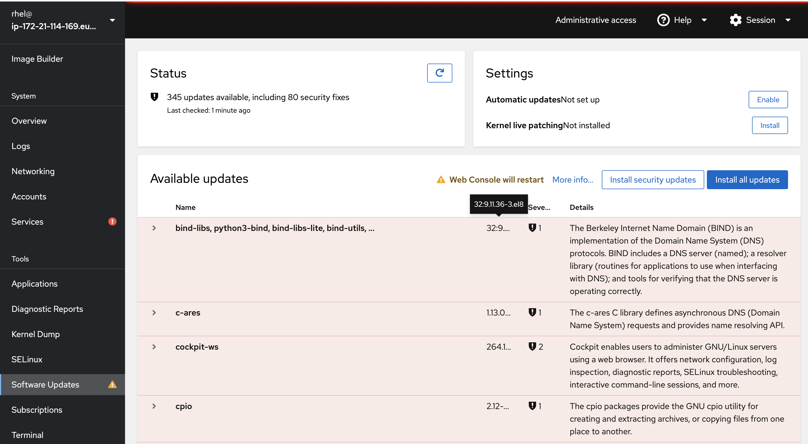

# Lab 1 Software management

This lab will introduce you to the basic concepts of installing applications in Red Hat Enterprise Linux.

## Intro to Software management in Linux

In Windows, there is really no uniform way to build, search for, install, update and remove software. Windows Update provides some of the features, such as update of some software.

In Linux - building, searching for, installing, upgrading and removing software - is something which is managed by package management tools. Typically there are one or two tools which manages this in a Linux operating system. Different Linux operating systems may use different tools and package formats, but a number of them shares tools and package format.

In Linux operating systems such as Red Hat Enterprise Linux (and Fedora and CentOS and many others) the package format is called RPM and (confusingly enough) the package management tools are called **RPM** and **DNF** (or yum). Let's have a quick look at the two with the without going into too much detail.

### The package format (and a tool) - RPM

If you want to distribute a piece of software (or many pieces) - you can build a package in which you put the files you want to distribute.

Think of the package as a zip file which includes some meta data such as name, version, author, a cryptographic signature, change log and importantly - dependencies on other software. The last item means that when you install a package, a package management tool can automatically see what more needs to be installed for your software to work - and install that too.

For Red Hat Enterprise Linux, the package format is called RPM. RPM packages have the suffix of .rpm. There is also a basic tool to query information about packages and do basic operations, which is also called RPM, the name of the command, when typed into a terminal is called ```rpm```.

### The package management tool - DNF (or yum)

There is an additional tool for managing software in Red Hat Enterprise Linux, called ```dnf``` in Red Hat Enterprise Linux 8 and ```yum``` in earlier versions of Red Hat Enterprise Linux (5, 6, 7).

In short, ```yum``` helps with the following tasks:

* Automatically installing dependencies for your software
* Installing, updating and removing packages (and their dependencies)

When we later on will be updating software, the ```Web console``` will be calling ```yum``` to do the actual work. But ```yum``` can also be called directly in a terminal to do the work.

## Updating packages using the Web console

We will now be using the Web console to show you one way in which you can update installed software in Red Hat Enterprise Linux. 

:boom: Locate the Software Updates menu item on the left side and click on it.

You will now see something like this:



Here you can patch all available software updates and security patches. As you can see there are two different buttons. On which installs security updates only and one that updates everything

:boom: Click the arrow before the sudo package to get below information. Note that security fixes are coloured differently.


:boom When you are ready press the blue **Install All Updates** button and have some patience.

:exclamation: If you installed patches that requires a reboot you will be presented with below dialog. Note: **DO NOT RESTART YOUR SYSTEM, PRESS IGNORE**


:boom: Press Ignore.

:thumbsup: If you have updated a system, the easiest way to ensure that all software running is using the updated versions is to restart your system, just as in Windows. However since this lab is running in AWS you will loose the connection to the host and your system may get a new address so please do not restart the server.

:boom: Go back to the Software Updates portion of the interface to see history.


:boom: Click on the arrow **>** to see the last transactionw.


## Installing add-ons for the Web console

For this excercise you will look at adding an add-on in the ```Web console``` to manage storage. This add-on is missing from the user interface.

:boom: Locate the Applications menu item on the left side menu as shown below.


:boom: Locate ```Storage``` and click the Install button located to the right. This will install the storage add-on.


You will now see that you have an additional entry in the menu system called ```Storage```, as shown below.


Continue to [lab 2](lab2.md)

Back to [index](thews.md)