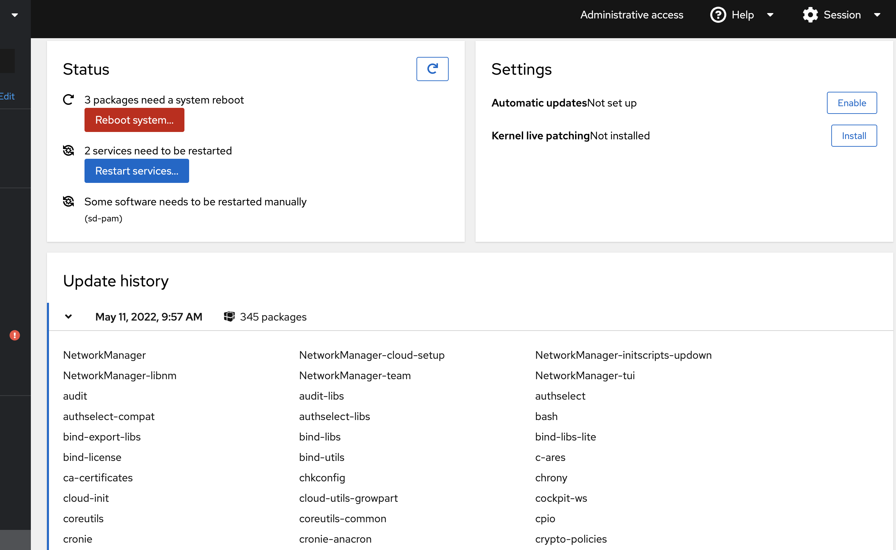
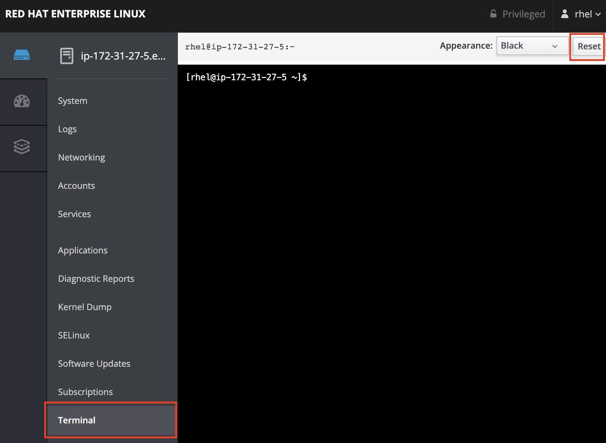
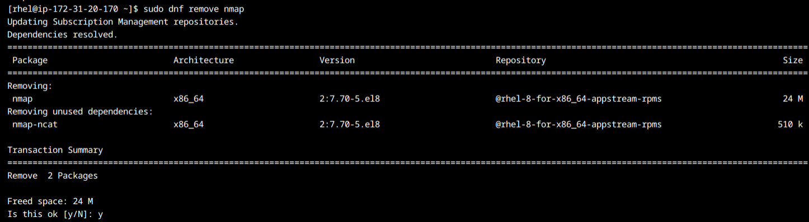
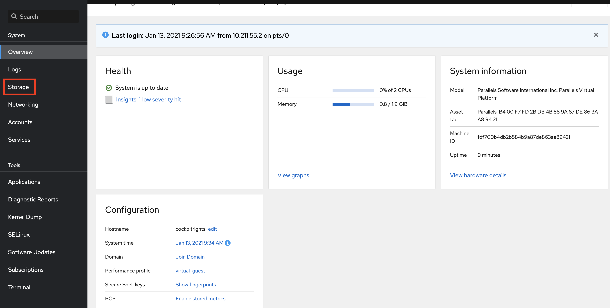

# Lab 1 Software management

This lab will introduce you to the basic concepts of installing and updating applications in Red Hat Enterprise Linux.

## Intro to Software management in Linux

In Windows, there is really no uniform way to build, search for, install, update and remove software. Windows Update provides some of the features, such as update of some software.

In Linux - building, searching for, installing, upgrading and removing software - is something which is managed by package management tools. Typically there are one or two tools which manages this in a Linux operating system. Different Linux operating systems may use different tools and package formats, but a number of them shares tools and package format.

In Linux operating systems such as Red Hat Enterprise Linux (and Fedora and CentOS and many others) the package format is called RPM and (confusingly enough) the package management tools are called ```RPM``` and ```DNF``` (or ```yum```). Let's have a quick look at the two with the without going into too much detail.

### The package format (and a tool) - RPM

If you want to distribute a piece of software (or many pieces) - you can build a package in which you put the files you want to distribute.

Think of the package as a zip file which includes some meta data such as name, version, author, a cryptographic signature, change log and importantly - dependencies on other software. The last item means that when you install a package, a package management tool can automatically see what more needs to be installed for your software to work - and install that too.

Below is information about the package containing the Apache web server.


For Red Hat Enterprise Linux, the package format is called RPM. RPM packages have the suffix of .rpm. There is also a basic tool to query information about packages and do basic operations, which is also called RPM, the name of the command, when typed into a terminal is called ```rpm```.

### The package management tool - DNF (or yum)

There is an additional tool for managing software in Red Hat Enterprise Linux, called ```dnf``` in Red Hat Enterprise Linux 8 and ```yum``` in earlier versions of Red Hat Enterprise Linux (5, 6, 7).

In short, ```yum``` helps with the following tasks:

* Automatically installing dependencies for your software
* Installing, updating and removing packages (and their dependencies)

When you are managing software using the ```Web console```, it uses underlying technolog in the operating system to get things done. 

## Updating packages using the Web console

We will now be using the Web console to show you one way in which you can update installed software in Red Hat Enterprise Linux. 

:boom: Locate the Software Updates menu item on the left side and click on it.

You will now see something like this:


Here you can patch all available software updates and security patches. As you can see there are two different buttons. On which installs security updates only and one that updates everything

:boom: Click the arrow before the sudo package to get below information. Note that security fixes are coloured differently.


:boom: When you are ready press the blue **Install All Updates** button and have some patience.

:exclamation: If you installed patches that requires a reboot you will be presented with below dialog. Note: **DO NOT RESTART YOUR SYSTEM, PRESS IGNORE**


:boom: Press Ignore.

:thumbsup: If you have updated a system, the easiest way to ensure that all software running is using the updated versions is to restart your system, just as in Windows. However since this lab is running in AWS you will loose the connection to the host and your system may get a new address so please do not restart the server.

:boom: Go back to the Software Updates portion of the interface to see history.



:boom: Click on the arrow **>** to see the last transaction.

## Using the terminal (search for, install, remove and query software)

Just keeping your system updated may not be enough. Sometimes people will ask you to install or remove software. You will then need to get familiar with the so called ```terminal```. The terminal is accessable via the ```Web console``` and allows a more powerful command line based interface to Linux. It is possible to manage Linux systems, only using this terminal, but it is easier to start off with a mix.

:boom: Click on the menu item to the left named ```Terminal``` as shown below.



:exclamation: If you find yourself disconnected from the terminal then all you need to do is press the ```Reset``` button in the top right corner

First off, we will use the ```rpm``` command line tool, to query about the status of packages. We will query a familiar piece of software, the ```Web console``` we are using right now. Try below tricks and see if you find them useful.

:boom: Run below command to query if a package exists.

```
rpm -q cockpit
```

:boom: Run below command to see more information about a package.

```
rpm -qi cockpit
```

:boom: Run below command to see the changelog for a package.

```
rpm -q cockpit --changelog
```

:boom: Run below command to list all files owned by a package.

```
rpm -ql cockpit
```

:boom: Run below command to see if any files delivered by this package has been changed or removed. This command outputs any changed files, if any, and with otherwise exit without output.

```
rpm -V cockpit
```

:boom: Run below command to see all files which were owned by a package (system wide) and have been changed or removed.

```
rpm -Va
```

Now we'll try to install and remove a piece of software, to do that, we'll use the ```dnf``` tool in Red Hat Enterprise Linux 8. To install and remove software is a priviledged task, which means we'll need to escalate our priviledges in the system. In our system (and normally in Linux systems in general) this is done using a piece of software called ```sudo```. ```Sudo``` can be configured to allow a user run commands as the systems administrator (in Linux, this user is called the root user, or just root). For now, we will not go deeper into how ```sudo``` works, simply enjoy the powers it gives you.


:boom: Run below command to run the ```dnf``` command to search for a piece of software called nmap. Please note the prefixing of the ```dnf``` command with ```sudo```. This is what makes the command run as an administrator. This is less dangerous than using administrator powers all the time.

```
sudo rpmdb --rebuilddb
```

```
sudo dnf search nmap
```

:boom: Let's install this software, which is a security scanner. We'll again escalate our priviledges using ```sudo```.

```
sudo dnf install nmap
```

Please note how ```dnf``` identified a software dependency for nmap, which is needed for nmap to work and installed that as well. To get nmap to install, you need to answer ```y``` to the question if to install it.


:boom: Now let's remove the software we installed by running below command. Again, we're using ```sudo``` as this is a priviledged task.

```
sudo dnf remove nmap
```



Again, answer ```y``` to the question if to remove the software and notice that ```dnf``` identified that the dependency we pulled in at install time (nmap-ncat) also get's removed, as it's only the nmap package which uses it.

## Installing add-ons for the Web console

For this excercise you will look at adding an add-on in the ```Web console``` to manage storage. This add-on is missing from the user interface. While add-ons can be installed using the ```dnf``` command, we can only install them in the web console itself.

:boom: Locate the Applications menu item on the left side menu as shown below.


:exclamation: :boom: If you cannot locate the Storage addon option as shown below. You will need to click on the refresh button as shown below.


:boom: Locate ```Storage``` and click the Install button located to the right. This will install the storage add-on.


You will now see that you have an additional entry in the menu system called ```Storage```, as shown below.



Continue to [lab 2](lab2.md)

Back to [index](thews.md)
