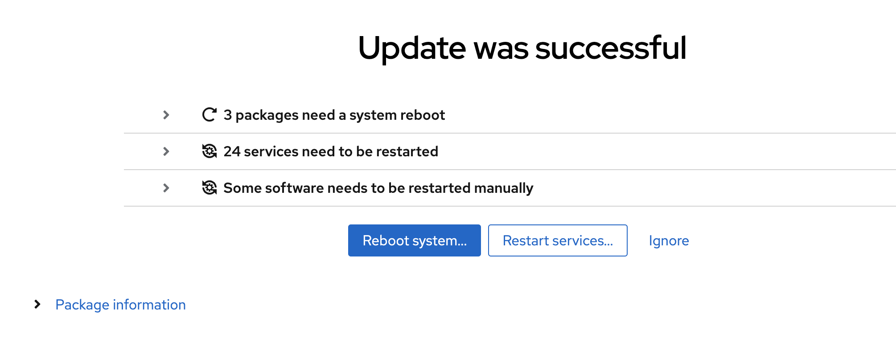

# Lab 1 Software management

To your left there is a bar with "applications" as those are known. As you can see there is already quite many. For this excercise you will look at adding a package to manage storage. This package is missing from the user interface.

## Add cockpit packages

Locate the Applications entry

To install the storage management please click the Install button:

And once you do you will have an additional entry in the menus:

We will install packages not present in the cockpit user interface in a later lab

## Update packages

In order to update packages you need to locate the Software Updates menu item and click on it.

You will now see something like this:

Here you can patch all available software updates and security patches. As you can see there are two different buttons. On which installs security updates only and one that updates everything

The security fixes are coloured differntly, click the arrow before the sudo package to get this info:

When you are ready press the blue **Install All Updates** button and have some patience.

 If you installed patches that requires a reboot you will be presented with this dialog:

We stongly recommend restarting when you have just updated. Easy to forget otherwise, however since this lab is running in AWS you will loose the connection to the host so please do not restart the server.

**Press Ignore please**

You can go back to the Software Updates portion of the interface to see history

Click on the arrow **>** to see the last transaction

Continue to [lab 2](lab2.md)

Back to [index](thews.md)