# Lab 2 Storage management

In the previous lab we installed the storage application for cockpit and now its the time to use it. Please locate the Storage menu entry and click on it now.

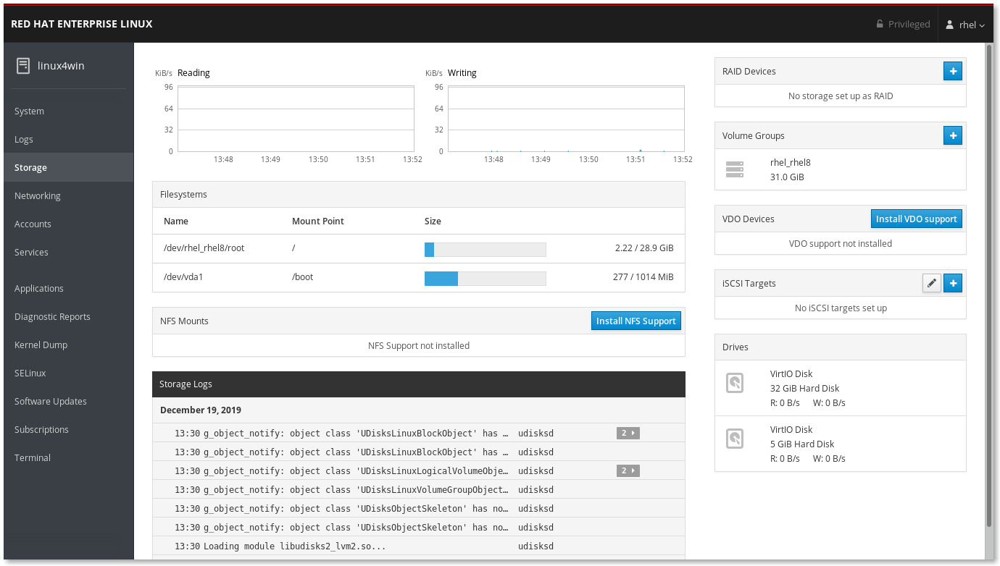

## Creating new filesystem

On the right hand side there are some frames with good information regarding your system. For instance you have information regarding the any **RAID Devices**, **Volume Groups** and so on.

In the right hand lower corner of this screen you will see the attached storage devices under **Drives**

If you click on the top one you will see some info regarding the partitions present on this device and what format they are in. To go back click again on menu item **Storage** in the menubar to your left.

There should also be a second drive attached, if you click on this one you will find that it has no partions, it is a brand new blockdevice.

Locate the **Create Partition Data** button and press it.

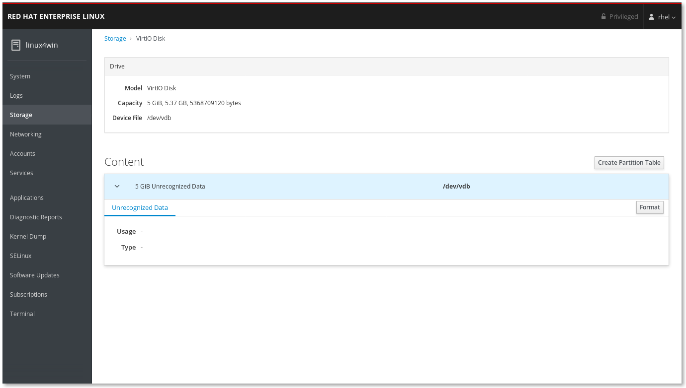

Select like in the picture below, you will get a disk using GPT partitions. 

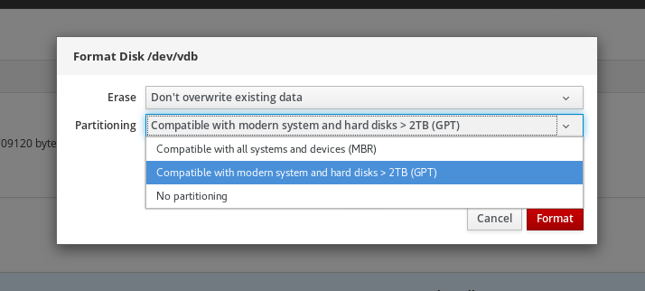

Now you have initialized this device.

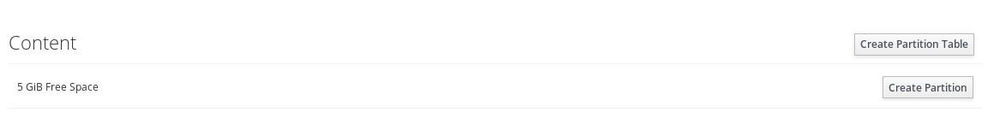

Next step is to make a Physical Volume of this disk. Please press the **Storage** entry in the menubar to your left to go back.

Locate the **Volume Groups** frame to your right and press the blue **+** sign

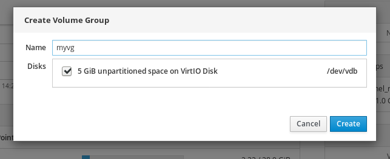

Give the new Volume Group a good uniqe name and check the checkbox infront of your device and press **Create**.

Next up is to create the **Logical Volume** that then will be mounted in the filesystem.

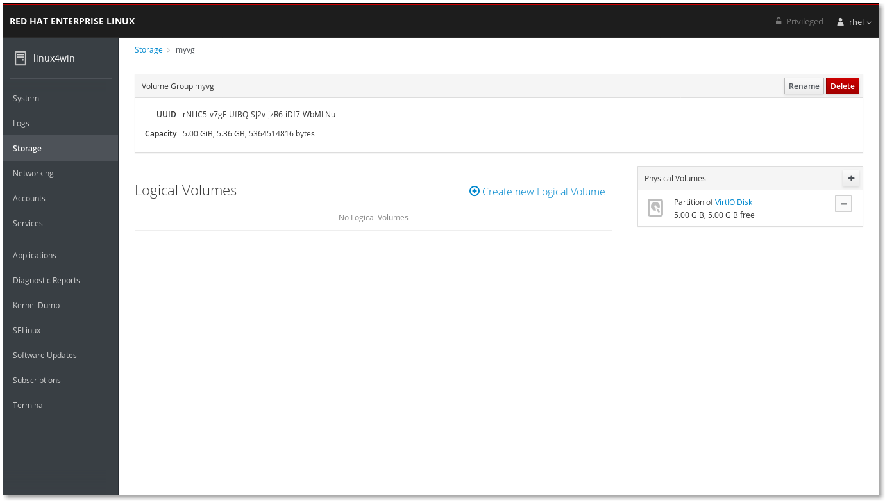

Press the blue text **Create new Logical Volume**

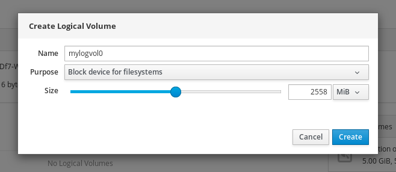

Give the Logical Volume a good name and allocate approx half of the size of the volume and press **Create**.

Now we have a Logical Volume. Please press the **>** to see details of the new volume.

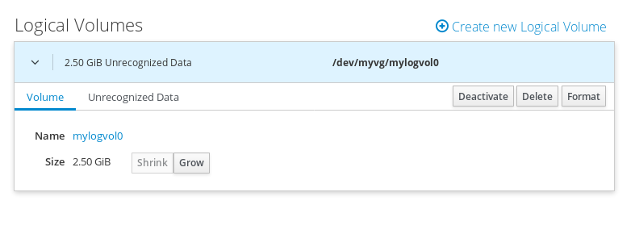

Now we are going to create the actual filesystem to be mounted. Please press the **Format** button.

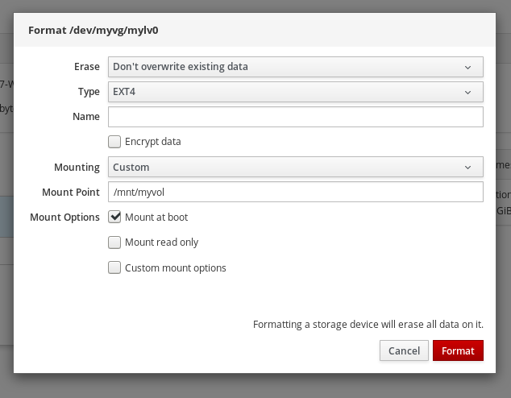

Even tho we set the volume to be mounted at boot it is not mounted in the filesystem. Please locate the **Filesystem** tab in the information frame. Here you will now find a **Mount** button. Please press the Mount button

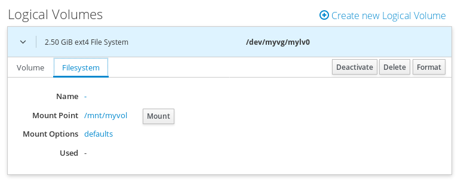

Now when we go back to **Storage** (press Storage in the menu to your left) there is a new entry in the Filesystems frame:

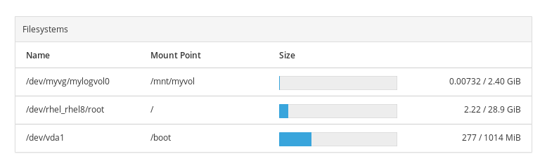

## Expanding a filesystem

Now we simulate that the root file system disk is getting full. So we will need to expand an existing filesystem. Locate the Volume Groups frame and click on the group containing the root vg.

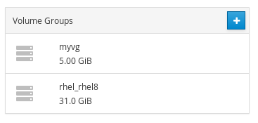

Locate the **Plus** sign in the Physical Volumes frame and click on that. The add Disks dialog is shown. You should locate the larger unformated disk (20 GB) and add that

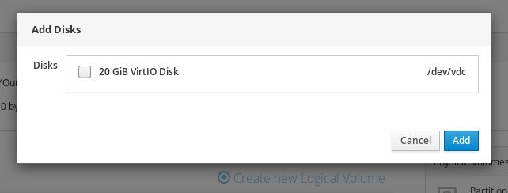

Notice that the Capacity of the Volume Group is now much larger. Press the **>** to get more details and click on the **Grow** button.

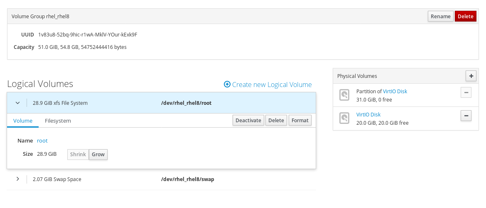

Slide the slider to your right, max it out.

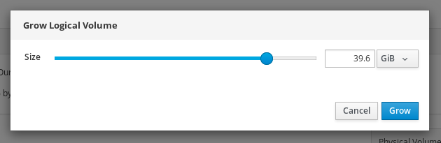

Now go back again to storage and notice that the root file system is much larger

Continue to [lab 3](lab3.md)

Back to [index](../README.md)