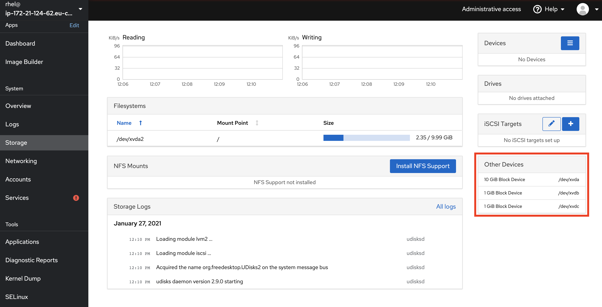
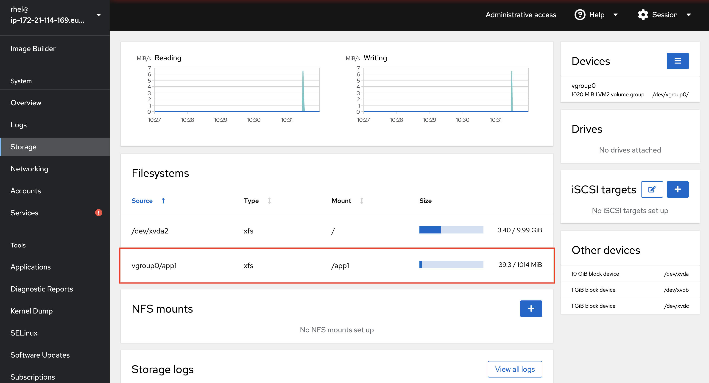

# Lab 2 Storage management

In the previous lab we installed the storage application and now its the time to use it. 

In this section of the lab, you will learn about how to manage storage in Red Hat Enterprise Linux. That includes how to detect new disks added, creating new filesystems and how to extend existing filesystems, two very common system admin tasks.

:boom: Locate the Storage menu entry and click on it.


In this view you can overview everything of importance regarding storage, including what storage devices are attached to the system, how do they perform, operate and information about the different storage configurations on this system. 

:boom: Have a look around and take note of the different information available.

If you are familiar with storage in general, you will recognised a lot of the terms on this page, such as ```RAID Devices```, ```Drives``` and ```NFS mounts```. The less familiar things may be:

* ISCSI Targets (This is SCSI over IP)
* Volume Groups (This is a Logical Volume Manager concept for a group of disk - which you will learn about in the next part of this lab)
* Storage logs (All logs collected that are related to storage)

## Intro to Storage Management

In Linux, just as in Windows, you can create partitions on which you can create filesystems. The downside of using filesystems created directly on partitions, is that it's difficult to increase the size of a partition, as it's connected to a physical disk. To solve this and other challenges, Red Hat Enterprise Linux uses a ```volume manager``` called ```LVM``` (```L```ogical ```V```olume ```M```anager). 

LVM allows a more flexible management of physical disks by creating an abstraction layer for the disks.


LVM for example by allows you to do:

* Pooling several disks together and presenting them as one (much like RAID 0)
* Allowing hot swapping disks in an easy manner without disruption
* Allowing for resizing of storage (extending it and shrinking it)
* Settings up storage tiers consisting of faster and slower disks
* Setting up storage caches powered by faster solid state disks
* Performing consistent backups, using snapshots
* Encryption of disks or pools or disk

...(and more) all using a single tool.

If you are looking for something similar in Windows, it would be ```Storage Spaces```.  The difference with Storage Spaces in Windows, except for having a richer feature set - is that LVM has existed in Linux for over 18 years (though, it was actually originally written in 1998), therefor LVM is a very battle tested piece of technology which is used by default in many Linux system for a long time.

## Creating new filesystem

You will now learn how to create a new filesystem in Red Hat Enterprise Linux. We will make use of ```LVM```, to provide a more flexible experience.

:boom: Go to the main ```Storage``` page as shown below.



In the right hand of this screen you will see the attached storage devices under ```Other Devices```.

:boom: Click on the top, called ```xvda```.  Here you will see information regarding the partitions and filesystems present on this device and what types are used.

:boom: Go back to the main storage page by clicking on menu item **Storage** in the menubar to your left.

There are also two more disks attached, called ```xvdb``` and ```xvdc```, both 1 GB in size. We are going to use the ```xvdb``` device for our new filesystem.

:boom: Locate the ```Devices```  menu on your right side and select Volume Groups, as shown below.


:boom: Give the new Volume Group a name (it needs to be unique) and select the checkbox infront of the ```xvdb``` device (second in the list) and press **Create**, as shown below.


We have now created a volume group, to which we in the future can add more disk to, this will prove to be useful in later labs.

Next up is to create the ```Logical Volume``` on which we will create the actual filesystem.

:boom: Click on your newly created Volume Group which is now diplayed on the main ```Storage``` page, as shown below. Note that a few MB was consumed by LVM meta data, as the Volume Group is not 1024 MB in size.


:boom: Press the blue button ```Create new logical Volume```, as shown below.


:boom: To create the logical volume, you simply give it a name and click create. We are allocating all space available in our volume group, which is set by default. Do that, as shown below. 


:boom: Now we have a Logical Volume (LV). Please click on the logical volume to expand it and get some more details of the volume, as shown below. Please note that it at this point says ```Unrecognised Data``` next to the size of the LV, this is because we have yet to put a filesystem on top of it.


:boom: Now we are going to create the actual filesystem and mount it to our system. Click the **Format** button, shown in the picture above.

:boom: To create a filesystem, give the filesystem a name and click ```Format```, as shown below. Once you have clicked ```Format``` you will be returned to the main page for your ```Volume Group```. Note that we are choosing the default filesystem format for Red Hat Enterprise Linux 8, which is called XFS. The limits for XFS are a maximum filesystem size of 1 Petabyte and the maximum filesize of 8 Exabyte. A single filesystem scales fairly well. We will also tell the system where to mount this filesystem, set directly by inputting Mount Point like in picture below


:boom: Next, go back to the ```Storage``` main page by clicking on ```Storage``` on the left side menu as shown below. Note the new entry in the middle of the page under ```Filesystems```.



## Expanding an existing filesystem

Now we'll pretend that our newly created filesystem has become full, meaning we'll need to extend the size of it. You will now see how LVM can be very useful.

:boom: Start by clicking on the filesystem which you created earlier, as shown below.


We are now at the main page for our ```Volume Group```, overviewing all ```logical volumes``` and ```filesystems``` inside of it. As we have already consumed all available storage in this ```Volume Group```, we need to add an additional disk to it, so we can get more space. Had our filesystem existed directly on a disk, this would have not been possible, as a filesystem normally cannot span several disks.

:boom: Let's add a new disk to our Volume Group. Click on the **+** located at ```Physical Volumes``` on the left side of the page, as shown in the picture below.


:boom: Check the box by the disk named ```/dev/xvdc``` and click ```Add```, as shown below.


After having added the disk, please note that the available space in our Volume Group has now doubled, indicated at the top of the page, where it states ```Capacity```. We are now ready to extend our ```Logical Volume```, which our filesystem resides on, very much like a filesystem resides on a partition.

:boom: To extend the ```Logical Volume```, click on ```Grow``` on our Volume, as shown below.


:boom: Next, slide the slide bar to the right, to consume the space available and click on ```Grow```, as shown below.


If you now check the filesystem, notice that it's now approximately 2 GB in size, instead of 1 GB. Extending the filesystem itself has been done automatically be the ```Web console``` so that we do not have to do that seperately.

Continue to [lab 3](lab3.md)

Back to [index](thews.md)
