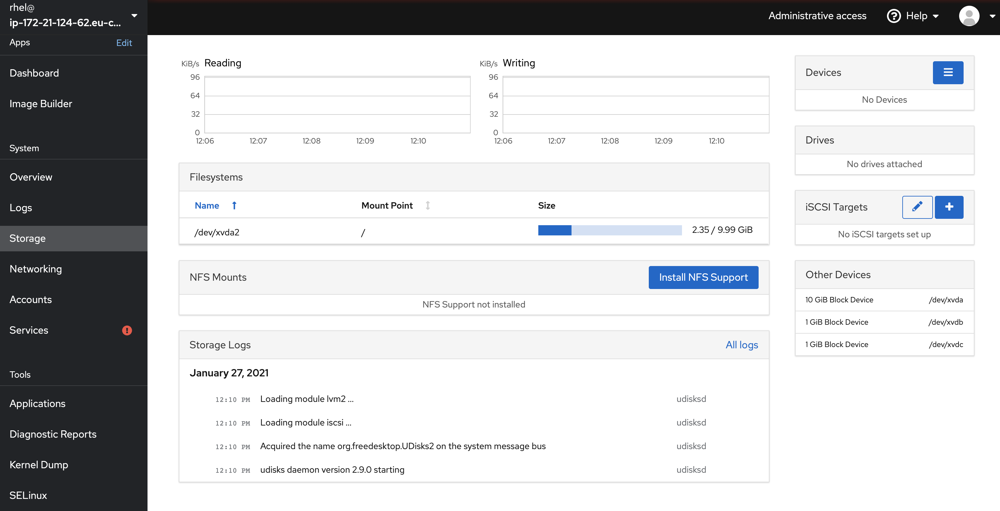

# Lab 2 Storage management

In the previous lab we installed the storage application and now its the time to use it. 

In this section of the lab, you will learn about how to manage storage in Red Hat Enterprise Linux. That includes how to detect new disks added, creating new filesystems and how to extend existing filesystems, two very common system admin tasks.

:boom: Locate the Storage menu entry and click on it.



In this view you can overview everything of importance regarding storage, including what storage devices are attached to the system, how do they perform, operate and information about the different storage configurations on this system. 

:boom: Have a look around and take note of the different information available.

If you are familiar with storage in general, you will recognised a lot of the terms on this page, such as ```RAID Devices```, ```Drives``` and ```NFS mounts```. The less familiar things may be:

* VDO Devices (This is a deduplication technology in Linux)
* ISCSI Targets (This is SCSI over IP)
* Volume Groups (This is a Logical Volume Manager concept for a group of disk - which you will learn about in the next part of this lab)
* Storage logs (All logs collected that are related to storage)

## Intro to Storage Management

In Linux, just as in Windows, you can create partitions on which you can create filesystems. The downside of using filesystems created directly on partitions, is that it's difficult to increase the size of a partition, as it's connected to a physical disk. To solve this and other challenges, Red Hat Enterprise Linux uses a ```volume manager``` called ```LVM``` (```L```ogical ```V```olume ```M```anager). 

LVM allows a more flexible management of physical disks by creating an abstraction layer for the disks.


LVM for example by allows you to do:

* Pooling several disks together and presenting them as one (much like RAID 0)
* Allowing hot swapping disks in an easy manner without disruption
* Allowing for resizing of storage (extending it and shrinking it)
* Settings up storage tiers consisting of faster and slower disks
* Setting up storage caches powered by faster solid state disks
* Performing consistent backups, using snapshots
* Encryption of disks or pools or disk

...(and more) all using a single tool.

If you are looking for something similar in Windows, it would be ```Storage Spaces```.  The difference with Storage Spaces in Windows, except for having a richer feature set - is that LVM has existed in Linux for over 18 years (though, it was actually originally written in 1998), therefor LVM is a very battle tested piece of technology which is used by default in many Linux system for a long time.

## Creating new filesystem

You will now learn how to create a new filesystem in Red Hat Enterprise Linux. We will make use of ```LVM```, to provide a more flexible experience.

:boom: Go to the main ```Storage``` page as shown below.


In the right hand lower corner of this screen you will see the attached storage devices under ```Drives```.

:boom: Click on the top, called ```xvda```.  Here you will see information regarding the partitions and filesystems present on this device and what types are used.

:boob: Go back to the main storage page by clicking on menu item **Storage** in the menubar to your left.

There are also two more disks attached, called ```xvdb``` and ```xvdc```, both 1 GB in size. We are going to use the ```xvdb``` device for our new filesystem.

:boom: Locate the ```Volume Groups``` on your right side and press the blue **+** sign, as shown below.


:boom: Give the new Volume Group a name (it needs to be unique) and select the checkbox infront of the ```xvdb``` device (second in the list) and press **Create**, as shown below.


We have now created a volume group, to wich we in the future can add more disk to, this will prove to be useful in later labs.

Next up is to create the ```Logical Volume``' on which we will create the actual filesystem.


:boom: Click on your newly created Volume Group which is now diplayed on the main ```Storage``` page, as shown below. Note that a new MB was consumed by LVM meta data, as the Volume Group is not 1024 MB in size.


:boom: Press the blue text ```Create new Logical Volume```, as shown below.


Give the Logical Volume a good name and allocate approx half of the size of the volume and press **Create**.

Now we have a Logical Volume. Please press the **>** to see details of the new volume.


Now we are going to create the actual filesystem to be mounted. Please press the **Format** button.


Even tho we set the volume to be mounted at boot it is not mounted in the filesystem. Please locate the **Filesystem** tab in the information frame. Here you will now find a **Mount** button. Please press the Mount button


Now when we go back to **Storage** (press Storage in the menu to your left) there is a new entry in the Filesystems frame:


## Expanding a filesystem

Now we simulate that the root file system disk is getting full. So we will need to expand an existing filesystem. Locate the Volume Groups frame and click on the group containing the root vg.


Locate the **Plus** sign in the Physical Volumes frame and click on that. The add Disks dialog is shown. You should locate the larger unformated disk (20 GB) and add that


Notice that the Capacity of the Volume Group is now much larger. Press the **>** to get more details and click on the **Grow** button.


Slide the slider to your right, max it out.


Now go back again to storage and notice that the root file system is much larger

Continue to [lab 3](lab3.md)

Back to [index](thews.md)