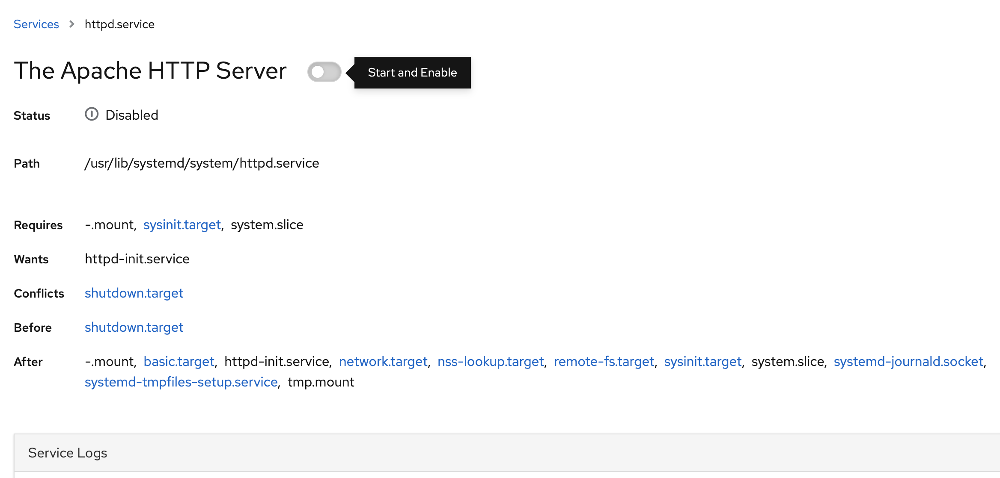

# Lab 3 Service management

Now we are going to look at services running in the linux system. In Red Hat Enterprise Linux the system for handling services is systemd. Locate the menu entry called **Services** and click that.


You will now get a list of installed service definitions. You can filter on name, input "sssd" into the filter box to only show the System Security Services Daemon. If you click on the entry in the list you will get more details regarding the service:


In this interface we can **Stop/Restart/Reload** the service. **Stop** is pretty self-expainatory. **Restart** is just a **Stop** followed by a **Start**. **Reload** instructs the daemon to reload any configuration files that the service relies on.

Now we are going to install a new service that we will need to set to start up automatically when the server boots up. Locate the Terminal menu entry to your left and click on that.


Here you can interface with the ŕuning server and do stuff that is not implemented in the user interface. Like installing the apache webserver. We will do that now. Please type exactly this into the terminal:

```
sudo yum install httpd
```
When promted please type the password of user **rhel** (redhat)
```
[sudo] password for rhel: 
```
And when the transaction is staged you will be asked to verify what will be installed.
```
Dependencies resolved.
============================
 Package                           Architecture          Version                                                Repository                                       Size
=============================
Installing:
 httpd  x86_64  2.4.37-16.module+el8.1.0+4134+e6bad0ed  1.4 M
Installing dependencies:
...abriviated for readability...
Transaction Summary
============================
Install  10 Packages

Total download size: 2.0 M
Installed size: 6.1 M
Is this ok [y/N]:
```
Type "y" and press Enter to install the apache webserver. Now when the service is installed we want to start and enable it to start at boot.

Go back to services and filter for "httpd". You should see an entry called httpd.service. Please click on that entry now.



Now you should **Start** the service and set it to **Enabled**. Now you know how to install apache webserver and set it to always run, even after reboot.

Continue to [lab 4](content/lab4.md)

Back to [index](../README.md)