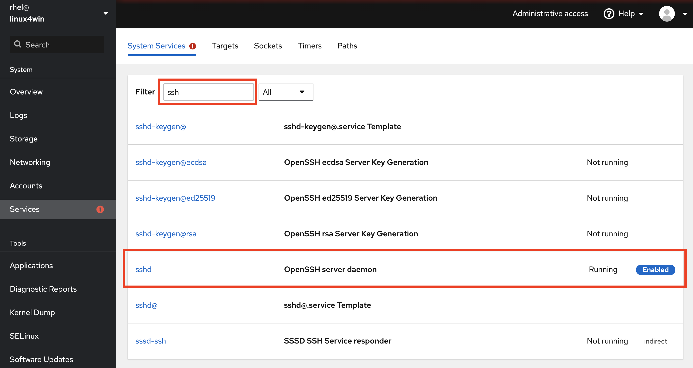

# Lab 3 Service management

Now we are going to look at services running in the linux system. In Red Hat Enterprise Linux (6, 7, 8) the system which handles services is called ```systemd```. 

:boom: Locate the menu entry called ```Services``` and click on that to get to the main page for managing services. Click around and explore the different services running on your system.

:exclamation: Do not randomly start / stop services if you do not know what they do, as this may break the system.


## An intro to Service management in Linux

During the development of Linux as an operating systems, there has been several different systems which has provided service management. Today, the most widely adapted system is called ```systemd``` which is what also is used in Red Hat Enterprise Linux (6, 7, 8). ```Systemd``` was originally developed by ```Red Hatters Lennart Poettering and Kay Sievers``` to solve issues that the previously used system, ```System V init``` failed to handle.

```Systemd``` does do a number of other jobs as well, futher unifying the management of services across different Linux operating systems. A majority of Linux operating systems uses ```systemd```.

```Systemd``` provides a wealth of features, and acts like a glue between applications and the Linux kernel, we will focus on a limited scope of features, including:

* Service management - Making sure services get's properly bootstrapped, started and stopped - at boot, shutdown or runtime of the Linux operating system
* Event logging - collecting events from services and making the events searchable

For more information about ```systemd``` have a look at [the Wikipedia page for systemd (https://en.wikipedia.org/wiki/Systemd).](https://en.wikipedia.org/wiki/Systemd "Systemd wikipedia page")  

## Reviewing services on a system

At the main ```Services``` page there's a list of all installed services on this system, listed under the ```System Services``` tab. All this information is provided from ```systemd```, which provides a neat programmable interface.

:boom: Try filtering the services, to get information about a specific service. Type in ```ssh``` to get information about ```S```ecure ```Sh```ell - the service which manages secure and encrypted remote terminal access to our system. Further click on the entry which reads ```sshd.service```, as shown below.



:boom: Explore the services page for the Secure Shell services, shown below. Try restarting, starting and stopping the service and see what information you get about the status of this service.

:exclamation: ```Make sure the service is started before you leave the page```. 

Key information on this page includes: What's the status of this service? Will it automatically start at boot? When will it start? And logs for this specific service.


Now we are going to install a new service that we will need to set to start up automatically when the server boots up. For this, we will need the terminal.

:boom: Locate the ```Terminal``` menu entry to your left and click on that.


As noted before, here you can interface with the command line interface of the server and do things that is not implemented in the user interface of the```Web console``` - Like installing the apache webserver - which is what we will do now. We will again use ```sudo``` to escalate our priviledges.

:boom: Type below commands into the terminal. This will install the Apache Web server:

```
sudo dnf install httpd
```

:boom: When ```dnf``` has identified what needs to be installed, you will be asked to verify what will be installed. Answer ```y```, as shown below:
.
```
Dependencies resolved.
============================
 Package                           Architecture          Version                                                Repository                                       Size
=============================
Installing:
 httpd  x86_64  2.4.37-16.module+el8.1.0+4134+e6bad0ed  1.4 M
Installing dependencies:
...abriviated for readability...
Transaction Summary
============================
Install  10 Packages

Total download size: 2.0 M
Installed size: 6.1 M
Is this ok [y/N]: y
```

Selecting ```y``` installs not only the binaries for the Apache web server and the dependencies it needs to work, but also a services definition for it. This allows us to manage the state of Apache using the ```Services``` interface in the ```Web console```.

:boom: Click on services and filter for ```httpd```, just as you did previously with ssh. You should see an entry called ```httpd.service```. Click on that entry, which will take you to the below shown page.


:boom: Click on the ```Start and Enable checkbox``` - this defines that it should start up at boot time. Verify that Apache started up properly by reviewing log output on the bottom of the page.

:exclamation: You will not be able to reach the web server using a browser. This is something we will fix in the next lab.

Now you know how to install Apache Web server on Linux and set it to always run, even after reboot.

Continue to [lab 4](lab4.md)

Back to [index](thews.md)
