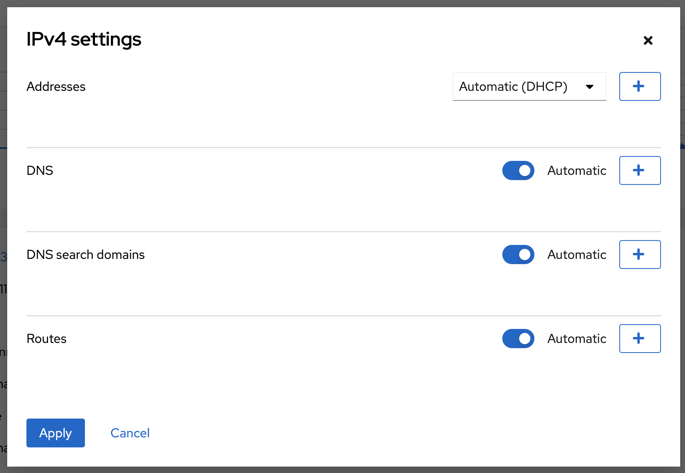

# Lab 4 Network configuration

This part of the labs deals with the basic network operations you are likely to want to do in Linux, including settings for network interfaces, managing firewall openings and doing basic troubleshooting of your networking. 

:boom: Please locate the menu entry called **Networking** and click on it. Spend some time exploring the page, without changing anything.

## Intro to Networking on Linux

The networking capabilities in Linux are advanced, this is one of the reason why it's common to see Linux as the operating systems on commercial switches, routers and network firewalls. It means that if you like, you can go beyond the normal networking features found on a server and turn a Linux system into a fully functioning swich, router or network firewall. That is not something we will do here.

### Network device naming

You will find that network interfaces on Linux are called different things, depending on what distribution you are using or depending on specific configuration in place on a system. Linux provides great flexibility when it comes to what you want the system to name the network devices. In general, there are two different naming schemes in use.

* Predictable naming
* Unpredictable naming

Traditionally on Linux, the unpredictable naming scheme is the most common one and it works like in Windows, which is that the operating system will give network interfaces names like ```Ethernet 1```, ```Ethernet 2``` based on which interface it sees first. This has the obvious disadvantage that if you have multiple network interfaces, it can become difficult to know which interface is which and therefor, which interface should be configured in what way. This has implications from both a management and security perspective. As an example, if you replace a faulty network card, it may change name with an unpredictable naming scheme.

In Linux, with the default unpredictable naming scheme, an interface is called ```eth0```, ```eth1``` ... and so on.

The predictable naming scheme, which is the default one used in Red Hat Enterprise Linux 8, gives interfaces names which is based on what type of card it is and where it is located in a server. Names could then be, for example, ```eno1```, ```ens1``` or ```enp1s1```.

[For more information about how the predictable naming scheme works, read more here.](https://access.redhat.com/documentation/en-us/red_hat_enterprise_linux/8/html/configuring_and_managing_networking/consistent-network-interface-device-naming_configuring-and-managing-networking "Red Hat Enterprise Linux 8 documentation page")  

### Firewalling on Linux
Depending on what Linux operating system are you using, there may be different tooling to manage firewalling. The most used technology to filter network traffic on Linux is called ```iptables```. In Red Hat Enterprise Linux 8, the technology used to filter packages is called ```nftables```. ```Nftables``` has the advantage that you can handle mixes of IPv4 and IPv6 rules easier. It's still very common to see ```iptables``` being used though. Rules are then managed using a command line interface in a terminal.

In Red Hat Enterprise Linux, since version 7 of the operating system, a management service called ```firewalld``` has been provided to abstract away from what technology is used and to better provide a programmable interface for firewall rules. Using ```firewalld``` is what allows the ```Web console``` to provide its firewall management features.

## Static and Dynamic IP assignment

:boom: Go to the main ```Networking``` page. Under ```Interfaces``` we can see the different network cards detected on this system. Locate the network device named ```eth0```. Bonus points if you can figure out what network device naming scheme is in use on this system.


:boom: Click on the eth0 device displayed in the list.


Here you can see details regrading the network interface, including things like MAC address, IP version 4 and 6 addresses, if the interface receives an ethernet carrier signal, if the device will be activated on boot and if static IP management or DHCP is used. 

:exclamation: We will now see how we can manage the IP settings for this network card. **DO NOT CLICK APPLY / SAVE ANY SETTINGS AS THAT WILL BREAK NETWORKING FOR YOUR SERVER, RENDERING IT USELESS**

:boom: To see how we can configure static IP settings, click on the blue **Edit** text after ```(Automatic DHCP)```. A new window as shown below will then appear. 



:exclamation: Again, during the next exercise, **DO NOT CLICK APPLY**.

:boom: Try changing from ```Automatic (DHCP)``` to ```Manual``` to enable entering in static IP details. If you click on the buttons that reads ```Automatic``` for ```DNS```, ```DNS Search Domain``` and ```Routes``` and then the ```+``` sign on the right side of this menu, you disable getting information via DHCP and enables you to input manual information. 

:boom: Click **Cancel** when you are done exploring.

## Managing firewall openings using the Web console

In lab3 we installed and started the apache webserver. The service is running but we cannot access it since the internal firewall is blocking any incoming connections. Lets verify this.


:boom: Try accessing the web server by typing in the IP-address of your system into a new tab on your web browser as shown below and verify that the communication is blocked:

```
http://same.ipaddress.as-your.webconsole
```

:exclamation: Please note that it's ```http://``` and not ```https://```.

 :boom: Next, we will access the web server from locally on our server. Click on the ```Terminal``` menu option on the left hand menu and type in below command.

```
curl localhost
```

```Curl``` is a small networking schwitz army knife, which for example can talk http. You will see the raw unformated HTML output from the Apache Web servers default web page, as shown below.


Next, we're going to open up external communication to our web server.

:boom: Go to the ```Networking``` main page and locate where it says ```Firewall``` and click on the button ```Edit rules and zones```. The detailed firewall page will now appear, as shown below.


Let's explain what you are seeing. On the top, where it reads ```Firewall``` you can enable and disable the firewall on this server.

Below there, it says ```public zone```. Zones are basically collections of rules, which we can connected to different networks that a system is connected to. By default, there is only one zone, called ```Public```, but we can pratically have unlimted number of zones, if needed.

In the ```public zone``` it says ```Service```. As we are using ```firewalld``` to manage the firewall on this system, firewall rules can be abstracted away from and defined as services, where each service lists what ports needs to be opened up. This reduces the risk of administrators forgetting to open up specific ports, for services which requires many different ports to be open to function.

Next we will allow communication for our web server.

:boom: Locate and click on the blue ```Add Services``` button to the right of ```Allowed Services```. Note the first service, ```Red Hat Satellite 6``` a good example of something using many different ports, which is easy to get wrong. Type in ```http``` where it says ```Filter Services``` and check the services for HTTP and HTTPS as shown below, then click ```Add Services```.


:boom: Note how the services were added to the list of ```Allowed Services```.

:boom: Now do a reload of the web page your browser. Or open up a new tab and type in the address to your server as shown below:

```
http://IP-OF-YOUR-SERVER
```

You should now see the Apache Web server test page, as shown below.


## Opening custom ports in the firewall

:boom: If you are not still on the main ```Firewall``` page in the ```Web console```, navigate there by clicking on ```Networking``` on the left side menu and then clicking on ```Firewall``` or the rules below.

:boom: Once again, locate the blue button called **Add Services** and click on it, but this time, select ```Custom Ports``` and try adding a custom port or port range. Don't forget to give it a **Description** as well.


:boom: Verify that your custom service got added.

## Basic troubleshooting

There are a lot of tools available for network troubleshooting. We will just spend a minute or two to introduce you to the most common ones.

:boom: Go to the ```Terminal``` menu option on the left hand menu.

:boom: Ping a system five times, type below in a terminal:

```
ping -c5 www.google.com
```

:boom: Do a traceroute to a system, type below in a terminal:

```
traceroute www.google.com
```

:boom: Do a fancy mix between a traceroute and a ping, type below the terminal (exit by pressing ```ctrl+c```)

```
mtr www.google.com
```

:boom: Sniff network traffic coming in on port 80 on our system, type below in the terminal:

```
sudo tcpdump -X tcp port 80
```

:boom: Now, access the web server you setup earlier from your web browser and see how network traffic is captured. Exit the sniffing session by pressing ```ctrl+c```

That was it. You are now done with the networking part of the lab and have hopefully learned one or two useful things about networking on Linux.

Next up, user management.

Continue to [lab 5](lab5.md)

Back to [index](thews.md)
