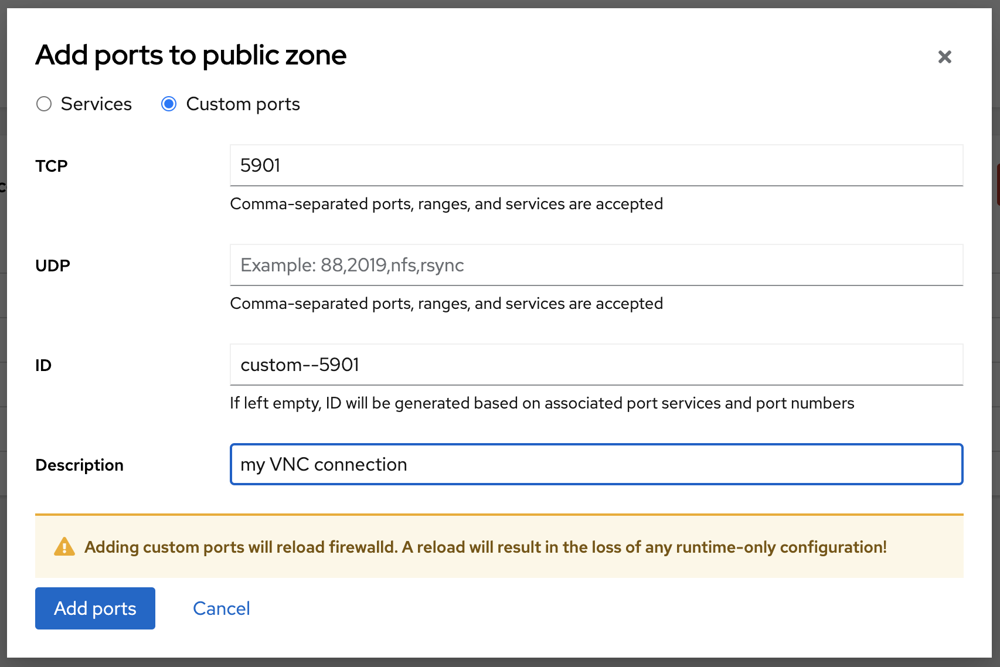

# Lab 4 Network configuration

The part of the labs deals with the basic network operations you are likely to want to do in Linux, including settings for network interfaces, managing firewall openings and doing basic troubleshooting of your networking. 

:boom: Please locate the menu entry called **Networking** and click on it. Spend some time exploring the page, without changing anything.

## Intro to Networking on Linux

The networking capabilities in Linux are advanced, this is one of the reason why it's common to see Linux as the operating systems on commercial switches, routers and network firewalls. It means that if you like, you can go beyond the normal networking features found on a server and turn a Linux system into a fully functioning swich, router or network firewall. That is not something we will do here.

### Network device naming

You will find that network interfaces on Linux are called different things, depending on what distribution you are using or depending on specific configuration in place on a system. Linux provides great flexibility when it comes to what you want the system to name the network devices. In general, there are two different naming schemes in use.

* Predictable naming
* Unpredictable naming

Traditionally on Linux, the unpredictable naming scheme is the most common one and it works like in Windows, which is that the operating system will give network interfaces names like ```Ethernet 1```, ```Ethernet 2``` based on which interface it sees first. This has the obvious disadvantage that if you have multiple network interfaces, it can become difficult to know which interface is which and therefor, which interface should be configured in what way. This has implications from both a management and security perspective. As an example, if you replace a faulty network card, it may change name with an unpredictable naming scheme.

In Linux, with the default unpredictable naming scheme, an interface is called ```eth0```, ```eth1``` ... and so on.

The predictable naming scheme, which is the default one used in Red Hat Enterprise Linux 8, gives interfaces names which is based on what type of card it is and where it is located in a server. Names could then be, for example, ```eno1```, ```ens1``` or ```enp1s1```.

[For more information about how the predictable naming scheme works, read more here.](https://access.redhat.com/documentation/en-us/red_hat_enterprise_linux/8/html/configuring_and_managing_networking/consistent-network-interface-device-naming_configuring-and-managing-networking "Red Hat Enterprise Linux 8 documentation page")  

### Firewalling on Linux
Depending on what Linux operating system are you using, there may be different tooling to manage firewalling. The most used technology to filter network traffic on Linux is called ```iptables```. In Red Hat Enterprise Linux 8, the technology used to filter packages is called ```nftables```. ```Nftables``` has the advantage that you can handle mixes of IPv4 and IPv6 rules easier. It's still very common to see ```iptables``` being used though. Rules are then managed using a command line interface in a terminal.

In Red Hat Enterprise Linux, since version 7 of the operating system, a management service called ```firewalld``` has been provided to abstract away from what technology is used and to better provide a programmable interface for firewall rules. Using ```firewalld``` is what allows the ```Web console``` to provide it's firewall management features.

## Static and Dynamic IP assignment

:boom: Go to the main ```Networking``` page. Under ```Interfaces``` we can see the different network cards detected on this system. Locate the network device named ```eth0```. Bonus points if you can figure out what network device naming scheme is in use on this system.


:boom: Click on the eth0 device displayed in the list.


Here you can see details regrading the network interface, including things like MAC address, IP version 4 and 6 addresses, if the interface receives an ethernet carrier signal, if the device will be activated on boot and if static IP management or DHCP is used. 

:exclamation: We will now see how we can manage the IP settings for this network card. **DO NOT CLICK APPLY / SAVE ANY SETTINGS AS THAT WILL BREAK NETWORKING FOR YOUR SERVER, RENDERING IT USELESS**

:boom: To see how we can configure static IP settings, click on the blue text which reads ```(Automatic DHCP)```. A new window as shown below will then appear. 


:exclamation: Again, during the next exercise, **DO NOT CLICK APPLY**.

:boom: Try changing from ```Automatic (DHCP)``` to ```Manual``` to enable entering in static IP details. If you click on the buttons that reads ```Automatic``` for ```DNS```, ```DNS Search Domain``` and ```Routes``` and then the ```+``` sign on the right side of this menu, you disable getting information via DHCP and enables you to input manual information. 

:boom: Click **Cancel** when you are done exploring.

## Enable service openings in firewall

We will however open for a service in the firewall. In lab3 we installed and started the apache webserver. The service is running but we cannot access it since the internal firewall is blocking any incoming connections. Lets verify this by accessing the page from the terminal on the server. Go to **Terminal**

```
curl -s localhost | python2-html2text
```
You should now see some output from the test page of apache on Red Hat Enterprise Linux. Now if you point your browser to the same page: http://hostname you will get 404. Not found. This we need to fix. On the **Networking** page locate the frame called **Firewall** and click where it says "3 Active rules"


This is the detailed firewall page. You can see the active zones and any active rules in the different zones. Zones are out of scope for this workshop. We are going to add a few services to make the web service available to the world. Locate the blue **Add Services** button and press it please.


This opens the add services window. In the filter-box please enter *http*. This will show any services availble with a name or a description containing *http*. Please check those present in the image above. Now do a reload of the page in the browser. Or open a new tab here http://hostname 

## Open single port in firewall

When we are still in the Firewall portion we are going to add a rule that allows a single tcp port to be accessed from the world. If you have already closed please locate the **Networking** menu item on your left and then please click on the frame called **Firewall**

Once here again locate the blue button called **Add Services**



This time we are adding just a port on TCP. Fill in like in the pic above and press the blue button **Add Ports**

Now you will have an entry in the list of allowed services called *myVNC* that is new.

Continue to [lab 5](lab5.md)

Back to [index](thews.md)