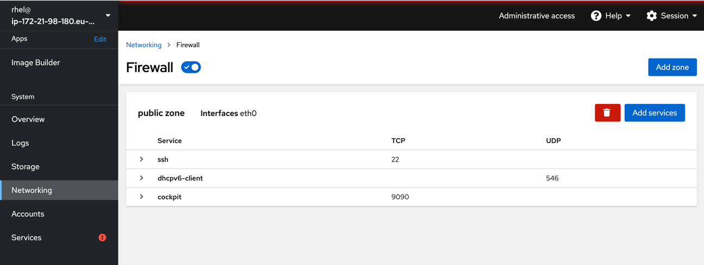

# Lab 3 Network configuration

Now we will turn to the networking options available in cockpit. Please locate the menu entry called **Networking** and click on it.

## Static/Dynamic ip assignment

Here there are two frames we will look at in more details. First we will check out settings for the attached network-card.


Locate the **Interfaces** frame and click on the eth0 device displayed in the list.


You will now see details regarding the setup of network device **eth0**. Notice that the checkbox [x] Connect automaticallyis checked. This means that the device is enabled and started at boot.

If you want to change the IPv4 settings you click on the Blue text (Automatic DHCP). Please do so now.


You can change from **DHCP** to **Manual** here and fill in your details. This is the primary ip of the server meaning that you will lose the cockpit connection when you press **Apply**. So be thorough. For this exercise we are not going to change anything. So please press **Cancel** and then **Networking** in the menu bar on your left.

## Enable service openings in firewall

We will however open for a service in the firewall. In lab3 we installed and started the apache webserver. The service is running but we cannot access it since the internal firewall is blocking any incoming connections. Lets verify this by accessing the page from the terminal on the server. Go to **Terminal**

```
curl -s localhost | python2-html2text
```
You should now see some output from the test page of apache on Red Hat Enterprise Linux. Now if you point your browser to the same page: http://hostname you will get 404. Not found. This we need to fix. On the **Networking** page locate the frame called **Firewall** and click where it says "3 Active rules"



This is the detailed firewall page. You can see the active zones and any active rules in the different zones. Zones are out of scope for this workshop. We are going to add a few services to make the web service available to the world. Locate the blue **Add Services** button and press it please.


This opens the add services window. In the filter-box please enter *http*. This will show any services availble with a name or a description containing *http*. Please check those present in the image above. Now do a reload of the page in the browser. Or open a new tab here http://hostname 

## Open single port in firewall

When we are still in the Firewall portion of cockpit we are going to add a rule that allows a single tcp port to be accessed from the world. If you have already closed please locate the **Networking** menu item on your left and then please click on the frame called **Firewall**

Once here again locate the blue button called **Add Services**


This time we are adding just a port on TCP. Fill in like in the pic above and press the blue button **Add Ports**

Now you will have an entry in the list of allowed services called *myVNC* that is new.

Continue to [lab 5](lab5.md)

Back to [index](../README.md)