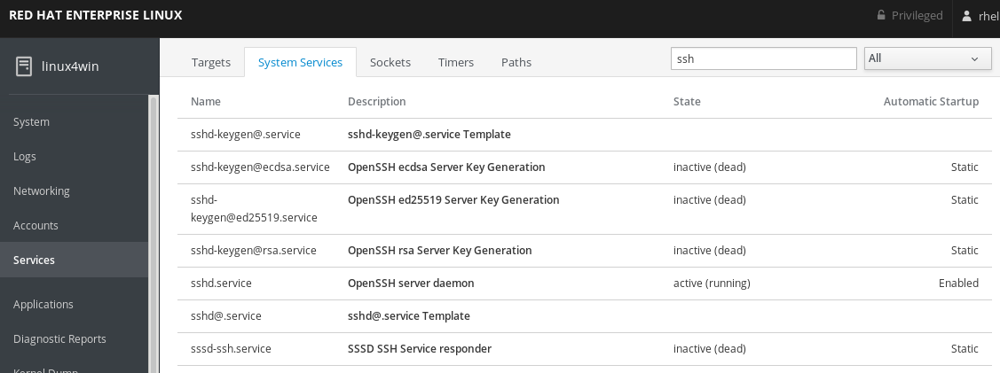

# User management (with Active Directory)

Usually you would have your identities in a central location like Active Directory from Microsoft. So now we are going to look at howto bind a linux server to AD for user and group information. However GPO's are not supported. Any group policies you want to apply needs to be done by some other configuration system like ansible.

## Connecting a server to Active Directory for authentication (no GPOs)

You will need to have the realmd package installed.  

```
sudo yum install realmd
```


Locate the button on the system where is says **Join Domain** in blue.


Now you get the join domain wizard. 


Fill in the domain address and wait for the discovery to run. It will say below if the domain can be joined or not. You can also specify the OU to put the computer-account in. Fill in the username/password of an account that can add computers. In this lab that is *wsadder/Password1*

## Assigning privileges to users (Run as Administrator configuration)

For users that are local this is a simple opperation. Locate the Accounts option in the menu to your left. And click:


This is where you can add more local accounts. Please press the Create New Account button and look at your options:


Press Cancel to close the add new user dialog and locate the entry called **rhel** and click.


Here you can set all kind of options including the ability to administer the server (checkbox called Server Administrator)

But none of the accounts from Active Directory is visible here. This will be addressed in future releases of cockpit.

So right now you will have to use the Terminal. Please click the terminal option in the menu on your left.

Type the following command into the terminal to get information regarding an account

```
id vsda@linux4win.local
```
Out comes info about the user like groups that is member of.
```
uid=579601105(vsda@linux4win.local) gid=579600513(domain users@linux4win.local) groups=579600513(domain users@linux4win.local),579601110(minions@linux4win.local)
```
In order for this account to be able to administer this computer we will need to add it to the local wheel group. This is done by the command shown below:
```
sudo usermod --append -G wheel vsda@linux4win.local
```
Please type the password of the account (*redhat*). This works on smaller scale. Not so much on larger scale where you most likely use Groupmembership for these kind of things. So in order to set this up we are going to create a file in a special location. 
```
ls -l /etc/sudoers.d/
```
Any files found in this location will be added to the sudoers rules that enables users to run commands as root (which is the highest level of access available on linux). So we are going to create one. This can be done in many ways. In this example we will use nano. And it is not installed. So we start there. 
```
sudo yum install nano
```
Then lets make the file
```
sudo nano /etc/sudoers.d/minions
```
```
%minions@linux4win.local ALL=(ALL) NOPASSWD: ALL
```
Now we need to set rights on the file. All files in the sudo system should have these:
```
-r--r-----. 1 root root 29 13 nov  2015 minions
```
So in order to set this we use chmod
```
sudo chmod 0440 /etc/sudoers.d/minions
```
So to test ths you will need to login as another account and try to run anything with sudo. Can be done like this:
```
sudo su - hger@linux4win.local
```
And then try a sudo command:
```
sudo ls /etc
```
You should get no errors

## Setting up access controls

Now we have the server connected to Active directory. And we have set how can become Administrator (root). But anyone in the organization can login to this system. First we are going to look at setting this on an ssh level, ssh is the way to remote manage any linux system. So we are going to add this to the end of the file which holds configuration for the ssh service.
```
sudo nano /etc/ssh/sshd_config
```
And add these two lines at the end
```
AllowGroups minions@linux4win.local
DenyUsers administrator administrator@linux4win.local
```
So now you have to be a member of the minions@linux4win.local Security Group in Active Directory to be allowed to login using ssh. Also we blocked access to the generic Administrator account which can pose a security issue if used.
Now we need to restart the sshd service. This can be done using the Services part of the menu.
Filter for ssh:

Then click on sshd.service and restart the service.


Continue to [lab 6](lab6.md)

Back to [index](thews.md)