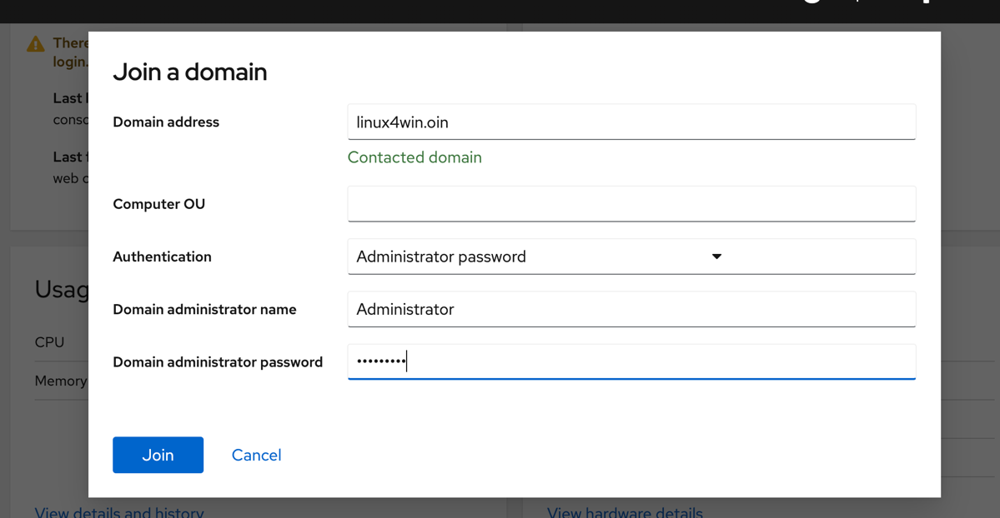

# User management

In this lab, you will learn how to manage users and groups in Linux. You will also try to connect your Linux server to Active Directory.

## Intro to user management in Linux

Just as in Windows, users are members of groups and this works as a basics for access controls in many systems. Users also has home directories and system settings that applies to them specifically. By default, a Linux server only uses local users. The default administrator user in Linux is as mentioned before, called ```root```. 

When managing more than a handful of systems, connecting them to some sort of centralized identity and authentication source is recommneded. In the Linux world, there is no single identity and authentication solution which most often is used. Red Hat Enterprise Linux includes an identity and authentication solution, called ```Red Hat Identity Management (Red Hat IDM)``` , if you do not have one.

:star: [If you want to read more about ```Red Hat IDM```, click here.](https://access.redhat.com/documentation/en-us/red_hat_enterprise_linux/8/html/considerations_in_adopting_rhel_8/identity-management-news_considerations-in-adopting-rhel-8 "Red Hat Enterprise Linux 8 documentation page")  

Even though Red Hat Enterprise Linux includes a solution for centralized user management, most commonly at large enterprises - Windows and Linux systems share solutions. It is common to use Active Directory, also for Linux systems.  

## User management (with Active Directory)

We will now look at how user management works in Linux using Active Directory. You will learn how to connect a Linux server to Active Directory for centralized identity and authentication. Please note that group policies or GPOs are not supported for Linux. Any group policies you want to apply needs to be done by a separate configuration system. Luckily, there are many available for Linux, such as ```ansible```. You can also get central policy management of Red Hat Enterprise Linux systems using ```Red Hat Satellite```.

:star: [Read more about Ansible, here: https://www.ansible.com](https://www.ansible.com "Ansible homepage")

:star: [Read more about Red Hat Satellite, here: https://www.redhat.com/en/technologies/management/satellite](https://www.redhat.com/en/technologies/management/satellite "Satellite homepage")

There are two different ways to use Active Directory for user management of Linux systems.

* Connecting Linux systems directly to Active Directory
* Using a system such as Red Hat Identity Management (IDM) to synchronized with Active Directory and then connecting Linux system to that system in turn

The second option is less common and more complicated. In this lab, we will deal with the first option, connecting a Red Hat Enterprise Linux system directly to Active Directory.

## Connecting your server to Active Directory (no GPOs)

To connect to Active Directory, we first need to install some software on our server.

:boom: Go to the ```Terminal``` menu item on the left side menu and type in below command to install the required software.

```
sudo dnf install realmd
```

:boom: Next, click on the ```Overview``` menu option on the top of the left side menu.  Locate the button on the system where is says **Join Domain** in blue and click on that to proceed to the join domain wizard.


:boom: Fill in the domain address as shown below and wait for the discovery to complete - indicated by the text ```Contacted domain```. In this example, we will not specify the OU to put the computer-account in. Continue and fill in the username/password of an account that can add computers and click ```Join```. Domain admin name and password for this lab is:

```
Username: Administrator
Password: Password1
```



You can now see the joined Active Directory domain displayed on the main ```System``` page, clicking on the domain name provides some basic information and provides a quick way leave the domain as well.

As you could see, integrating a Red Hat Enterprise Linux with Active Directory is a easy task. If wanted do this for a large number of Red Hat Enterprise Linux systems, we could have used a command line tool called ```adcli``` to join the domain. 

## Assigning privileges to users (Run as Administrator configuration)

For users that are local to the system, it's easy to provide access to Administrator (```root```) priviledges. 

:boom: Click on the ```Accounts``` menu option in the menu to your left, as shown below.


This is where you manage local users on the system. Things you can do here includes:

* Creating and deleting users
* Changing passwords
* Locking accounts
* Adding additional priviledges to users
* Terminate active user sessions

And more. We will now create a new local account.

:boom: Click on ```Create New Account button``` and fill in some information about your imaginary new user. To remove the risk of someone accessing this account remotely, do not check the ```Access``` check box and then click ```Create```


:boom: Once returned to the main ```Accounts``` page, click on your newly created account check the box of ```Server Administrator``` as shown below. Once you have checked the box - the setting is applied and you can return to the main ```Accounts``` page.


## Getting information about users in Active Directory

As you may have noticed, in the ```Accounts``` menu, there were only locale accounts and none from Active Directory. This will be addressed in future releases of the ```Web console```. Right now you will have to use the ```Terminal```.

:boom: Click the ```Terminal``` menu option in the menu on your left.

:boom: Type below command into the terminal to get information regarding two accounts in the Active Directory.

```
id vsda@linux4win.oin
id hger@linux4win.oin
```
This provides information about what user ID the users has and also what groups they are a member of (including group IDs of the groups).
```
uid=579601105(vsda@linux4win.oin) gid=579600513(domain users@linux4win.oin) groups=579600513(domain users@linux4win.oin),579601110(minions@linux4win.oin)
```
In order for this account to become administrator with full priviledges on this computer we will need to add it to the local administrator group, called ```wheel```.

:boom: Add the Active Directory user to the admin group by typing in below command in the terminal.
```
sudo usermod --append -G wheel hger@linux4win.oin
```

This ofcourse only works on smaller scale. Not so much on larger scale where you more likely use Groupmembership to govern what you are allowed to do. This is what we will do next, to connect a specific group in Active Directory with specific priviledges on a system.

In order to set this up we are going to use ```sudo``` and configure ```sudo``` to allow Administrator priviledges for members of one of the groups that the user vsda@linux4win.oin is a member of.

```Sudo``` automatically reads rules files, which defines who can do what, out of below directory
```
/etc/sudoers.d/
```

Now we are going to create a new rules file. This can be done in many ways. So that you will not have to learn a Linux terminal text editor, will will used ```echo```.

:boom: First, we will have to start a session running as the ```root``` (Administrator user). In the terminal, type in:
```
sudo su -
```
:boom: Now, let's create the file. We will use echo and redirect the output to the file. Copy and paste below line, to reduce risk of errors.
```
echo "%minions@linux4win.oin ALL=(ALL) NOPASSWD: ALL" >/etc/sudoers.d/minions
```
:boom: Next, verify the content of the file, using another useful little terminal tool ```cat```, which prints the content of files to the terminal. Use below command to show the content of the file:

```
cat /etc/sudoers.d/minions
```

Next, let's see if the vsda@linux4win.oin user also has gained Administrator priviledges. As administrator, we can become other users by using the ```su``` command. Type in below commands into the terminal. 
```
sudo su - vsda@linux4win.oin
```

:exclamation: If above command fails, it means that we screwed up the ```sudo``` configuration. Run below command to remove the failty configuration file and try again.

```
rm /etc/sudoers.d/minions
```


If everything went well. Try a to run the sudo command as the vsda@linux4win.oin by typing in:
```
sudo whoami
```
You should get the output as shown below.

```
[vsda@linux4win.oin@ip.. ~]$ sudo whoami
root
[vsda@linux4win.oin@ip.. ~]$ 
```

## Intro to access controls

Now we have the server connected to Active directory and configured who can use Administrator (root) priviledges. Next is to configure who is allowed to login to the system. Right now, as we have not configured any restrictions, anyone can login to the system (though, as normal users). 

There are many different ways to restrict access to a Linux system, in this chapter, we will touch upon the two most common options.

* Via configuration of the service itself (if supported by that service)
* Via PAM (Pluggable Authentication Modules)

```PAM``` is a dynamic and modular access system which Linux uses. It allows services to have specific rules which governs how the services allows and denies users access.

If an application do not have specific functions that allows for access restrictions, your choice will be PAM. We will deal with both these options, starting with PAM.

## Using PAM to secure the Web console

Red Hat Enterprise Linux comes with a PAM moduled called pam_listfile, which allows us to define a textfile which contains users or groups which should be granted access in a whitelist manner, or which would be denied access in a blacklist manner.

To create a whitelist for which group can access the ```Web console```, we need to modify its ```PAM``` ruleset and before we do this you will check with one of the users from Active Directory.

:boom: Choose ```Log Out``` from the ```Session``` meny in the top right corner. Then use ```vsda@linux4win.oin``` with password ```Password1``` to verify that this user can log in.

:boom: Choose ```Log Out``` from the ```Session``` meny in the top right corner and log back in with the ```rhel``` user

:boom: Go to the ```Terminal``` menu option on the left side menu and run below commands to enter into an administrator session:

```
sudo su -
```

:exclamation: As this can cause you to loose your access to the ```Web console``` ensure that you copy and paste the below commands and double check that it is made correctly.

:boom: Run the following command to create the whitelist for who can login via the console.

```
echo "rhel" >/etc/cockpit/allow_users.conf
```

:boom: Verify that the file contains only the line ```rhel``` by running below command.

```
cat /etc/cockpit/allow_users.conf
```

:boom: Now we will overwrite the current ```Web console``` PAM file, adding the pam_listfile whitelist. Copy and paste below commands into the terminal:

```
cat << 'EOF' >/etc/pam.d/cockpit
#%PAM-1.0
auth       required     pam_sepermit.so
auth       substack     password-auth
auth       include      postlogin
auth       optional     pam_ssh_add.so
auth       required pam_listfile.so onerr=succeed item=group sense=allow file=/etc/cockpit/allow_users.conf
account    required     pam_nologin.so
account    include      password-auth
password   include      password-auth
# pam_selinux.so close should be the first session rule
session    required     pam_selinux.so close
session    required     pam_loginuid.so
# pam_selinux.so open should only be followed by sessions to be executed in the user context
session    required     pam_selinux.so open env_params
session    optional     pam_keyinit.so force revoke
session    optional     pam_ssh_add.so
session    include      password-auth
session    include      postlogin
EOF
```

:exclamation: Do not miss that last line above, stating ```EOF```

:boom: Now, try to login using the other AD (hger@linux4win.oin) or any user you created in the previous lab. It will be unsuccessful, while you can still login as the ```rhel``` user.

## Securing SSH by configuring the service itself

By far the most common way of accessing Linux systems is via ```SSH``` - a service which provides a non-graphical terminal interface for a user, very much like the ```Terminal``` interface here in the ```Web console```. Let's look at how we can limit who can login via ```SSH```.

:boom: First, click on the ```Terminal``` menu option on the left hand menu. And run below command to start an administrator user session.

```
sudo su -
```

:exclamation: To reduce risk of errors, copy and paste the next two commands into the terminal.

To configure ```SSH``` to only allow one single group access and deny all other groups, run below command
```
echo "AllowGroups minions@linux4win.oin" >>/etc/ssh/sshd_config
```

We are further going to deny a user access (even if it is a part of the group we allowed access). That user is the generic administrator user in Active Directory.

:boom: Run below command to add the additional line which limits the user access.

```
echo "DenyUsers administrator administrator@linux4win.oin" >>/etc/ssh/sshd_config
```

Now you have to be a member of the minions@linux4win.oin Security Group in Active Directory to be allowed to login using ssh. Also we blocked access to the generic Administrator account which can pose a security issue if used.

:boom: Now we need to restart the sshd service for these settings to get applied. Click on the ```Services``` menu option to your left and filter for the sshd service as shown below.


Then click on sshd.service and restart the service. The service is now secured.

:star: [To use PAM to secure SSH and more things on SSH access controls have a look at this web page.](https://developer.ibm.com/articles/au-sshlocks/ "Securing SSH")

Continue to [lab 6](lab6.md)

Back to [index](thews.md)