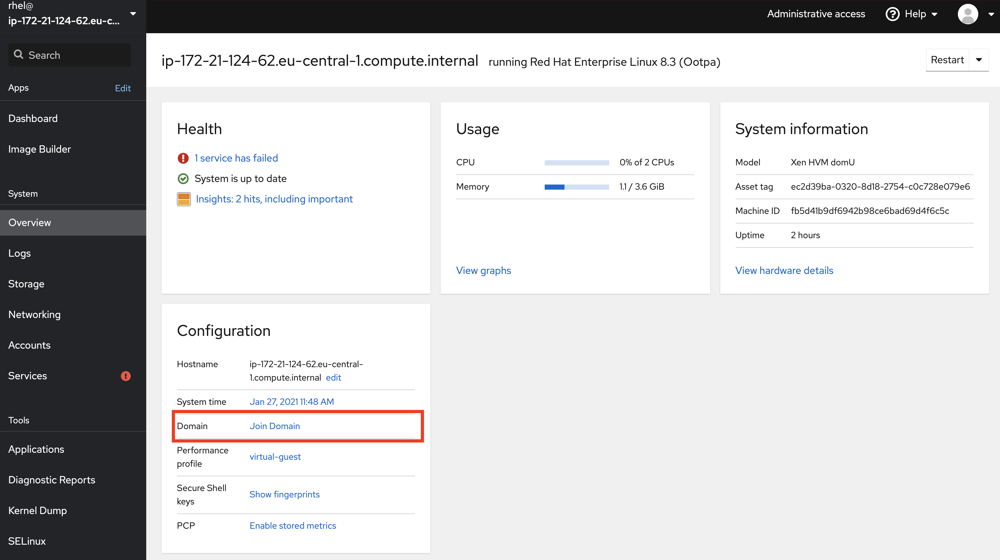

# User management (with Active Directory)

Usually you would have your identities in a central location like Active Directory from Microsoft. So now we are going to look at howto bind a linux server to AD for user and group information. However GPO's are not supported. Any group policies you want to apply needs to be done by some other system like ansible.

## Connecting a server to Active Directory for authentication (no GPOs)

Locate the button on the system where is says **Join Domain** in blue.

Once you click 

## Assigning privileges to users (Run as Administrator configuration)

## Setting up access controls

Continue to [lab 6](content/lab6.md)

Back to [index](../README.md)