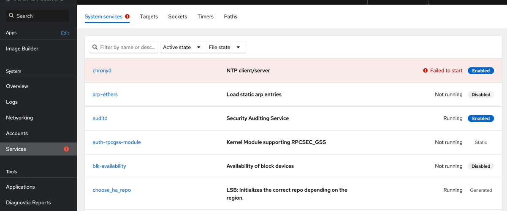
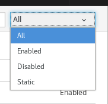
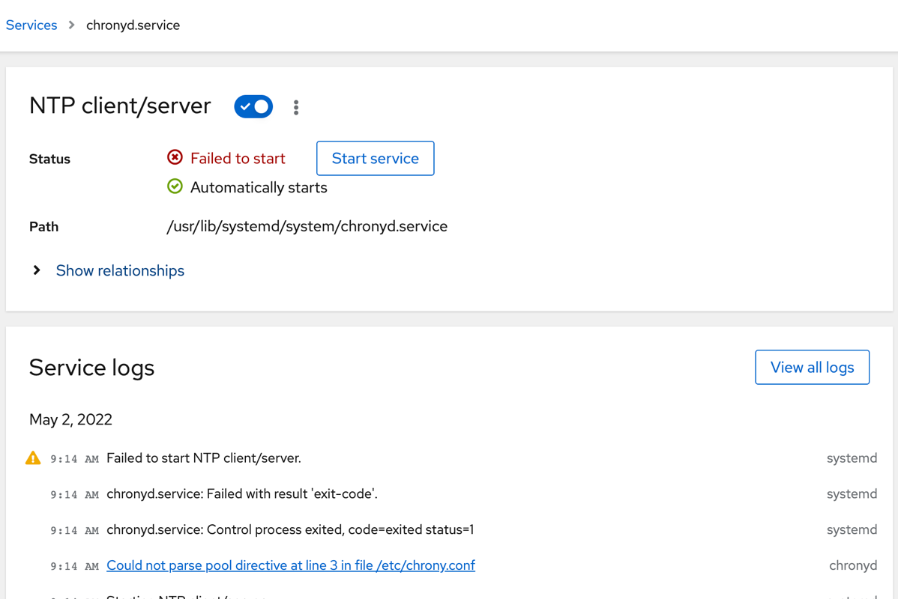
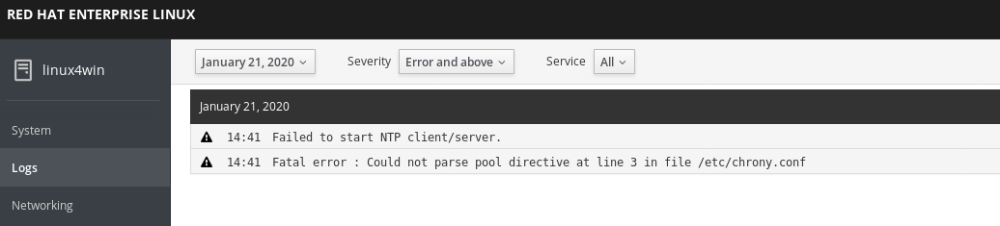
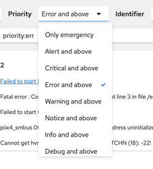

# Troubleshooting

In this chapter, you will learn about common troubleshooting tools in Linux. Also, you will get to troubleshoot a failing service (extra points if you already noticed it) on your system.

## Intro to troubleshooting in Linux

Troubleshooting in general can be divided into two main sections:

* Reviewing configuration
* Reviewing information such as logs, counters and output from commands run

The Web console can, as you have noticed by now, can provide quite a lot of good information for troubleshooting purposes. Many of the pages provides a lot of rich information in one place. Also, it provides a neat interface to logs. Logs can often be found in  many different formats and places. The ```systemd``` system ```journald``` collects most of them and provides them in the  ```Web console```. But, sometimes, you will need to use the terminal, as you have done in the previous in this lab to do some network troubleshooting.

There is no more advanced topic than troubleshooting a system. There are many different ways in Linux which more or less any given problem can be probed. For people who are new to Linux - it's important to use those good ol' search engines. There is an extremely rich set of information available online on pretty much every topic you can imagine. 

:thumbsup: When using Red Hat Enterprise Linux, there are some key services which helps you with troubleshooting.

* https://redhat.com/docs - The documentation hub for Red Hat products
* https://access.redhat.com - The Red Hat support page, which hosts a myriad of articles on different troubleshooting topics
* https://www.redhat.com/en/technologies/management/insights - An AI/ML powered service included with every Red Hat Enterprise Linux server which does automatic troubleshooting, also predicting problems before they happen. 

Let's start by doing some hands on troubleshooting of a service which is failing.

## Save the day, recover the failing service

We have installed a service that is failing. A service, as explained before, is an application which provides some useful thing on the system, like a web server or etc. If you feel confident, try to locate and fix the service without reading any further. If you want to get help on locating and fixing the service, read the below section ```Fixing the failing service```.

## Fixing the failing service

:boom: Review the running services by clicking on the **Services** option in the menu on your left.



:boom: You can filter services by their status. Click where it says **All** and select ```Enabled``` to view services that are set to start at boot.

```Disabled``` means services that are installed but not set to start at boot.
```Static``` services are started on-demand when they are needed by other services or when new hardware is plugged into the system.

 

:boom: Locate the service with a ```Failed``` state. 

:exclamation: SPOILER. 

The failed service is the chronyd service. Chronyd is the default NTP service on Red Hat Enterprise Linux. You should already have a good idea why it is not working. 

:boom: Click on the entry in the list to view more details.



:boom: To look at any logs collected on this system - click on the  ```Logs``` menu option in the menu on your left.



Here you can filter on severity of the log messages. 

:boom: Click the menu item where it says ```Severity```


:boom: Select a level below Error like ```Info and above```. Compare this with the other options for log-level.

Now you should have a pretty good idea of what the problem can be and even which file the error is located in. So in order to fix this we need to go to the terminal and fix the file.

:boom: When you are back in the ```Terminal```, run below command to fix the typo.
```
sudo sed -i -e 's/ibarst/iburst/' /etc/chrony.conf
```

:boom: Now that you have fixed the typo go back to menu item ```Services``` and restart the chronyd service. Verify that the service is now starting up without issues.

Give youself a hand, as you have now gone through all the main sections of this workshop. If you need some more challenges, continue forward to the extra assignments.

Continue to [assignment 1](assign1.md)

Back to [index](thews.md)