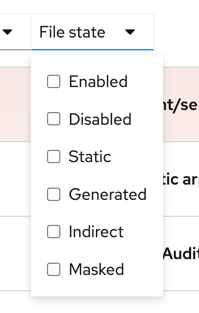
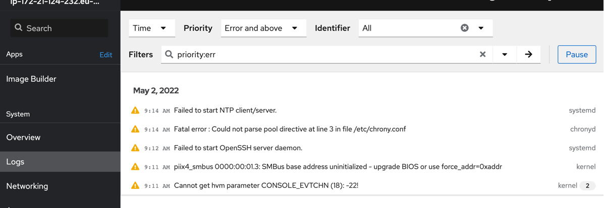

# Troubleshooting

In this chapter, you will get to troubleshoot a failing service (extra points if you already noticed it) on your system and get introduce to some basic troubleshooting tools commonly used.

## Intro to troubleshooting in Linux

Troubleshooting in general can be divided into two main sections:

* Reviewing configuration
* Reviewing information such as logs, counters and output from commands run

The Web console can, as you have noticed by now, can provide quite a lot of good information for troubleshooting purposes. Many of the pages provides a lot of rich information in one place. Also, it provides a neat interface to logs. Logs can often be found in  many different formats and places. The ```systemd``` system ```journald``` collects most of them and provides them in the  ```Web console```. But, sometimes, you will need to use the terminal, as you have done in the previous in this lab to do some network troubleshooting.

There is no more advanced topic than troubleshooting a system. There are many different ways in Linux which more or less any given problem can be probed. For people who are new to Linux - it's important to use those good ol' search engines. There is an extremely rich set of information available online on pretty much every topic you can imagine. 

:thumbsup: When using Red Hat Enterprise Linux, there are some key services which helps you with troubleshooting.

* https://redhat.com/docs - The documentation hub for Red Hat products
* https://access.redhat.com - The Red Hat support page, which hosts a myriad of articles on different troubleshooting topics
* https://www.redhat.com/en/technologies/management/insights - An AI/ML powered service included with every Red Hat Enterprise Linux server which does automatic troubleshooting, also predicting problems before they happen. 

Let's start by doing some hands on troubleshooting of a service which is failing.

## Save the day, recover the failing service

We have installed a service that is failing. A service, as explained before, is an application which provides some useful thing on the system, like a web server or etc. If you feel confident, try to locate and fix the service without reading any further. If you want to get help on locating and fixing the service, read the below section ```Fixing the failing service```.

## Fixing the failing service

:boom: Review the running services by clicking on the **Services** option in the menu on your left.


:boom: You can filter services by their status. Click where it says **All** and select ```Enabled``` to view services that are set to start at boot.

```Disabled``` means services that are installed but not set to start at boot.
```Static``` services are started on-demand when they are needed by other services or when new hardware is plugged into the system.

 

:boom: Locate the service with a ```Failed``` state. 

:exclamation: SPOILER. 

The failed service is the chronyd service. Chronyd is the default NTP service on Red Hat Enterprise Linux. You should already have a good idea why it is not working. 

:boom: Click on the entry in the list to view more details.


:boom: To look at any logs collected on this system - click on the  ```Logs``` menu option in the menu on your left.



Here you can filter on severity of the log messages. 

:boom: Click the menu item where it says ```Severity```


:boom: Select a level below Error like ```Info and above```. Compare this with the other options for log-level.

Now you should have a pretty good idea of what the problem can be and even which file the error is located in. So in order to fix this we need to go to the terminal and fix the file.

:boom: When you are back in the ```Terminal```, run below command to fix the typo.
```
sudo sed -i -e 's/ibarst/iburst/' /etc/chrony.conf
```

:boom: Now that you have fixed the typo go back to menu item ```Services``` and restart the chronyd service. Verify that the service is now starting up without issues.

## Common terminal troubleshooting tools

If you do not have the ```Web console``` on Red Hat Enterprise Linux, you may have to hack it in the ```Terminal``` world. Here comes a bunch of troubleshooting tools, which can provide most of the information available in the ```Web console``` and more.

:boom: Access the manual page (called man page) of a command or function by prefixing the command or function with ```top```,  type below to access the man page of the command ```top```:
```
man top
```

:boom: Get a list of what processes consumes CPU and memory with ```top``` (exit using ```q```), by typing the below command:

```
top
```

:boom: Review disk utilization using ```df```. Type below command to see information about all the filesystems on a system and what the utilization is.

```
df -h
```

:boom: Listing all running processes in the operating system.

```
ps -ef
```

:boom: List all open ports in the operating system.

```
netstat -tulpn
```

:boom: Scroll through all the logs on the system

```
journalctl
```

:boom: Scroll through all the logs on the system, reversed order, newer logs first

```
journalctl -r
````

:boom: Continiously show most recent log entries

```
journalctl -f
```

:boom: List specific logs for a service, show newer logs first.

```
journalctl -u httpd -r
```

:boom: Continiously show new log entries for a service.

```
journalctl -u httpd -f
```

:star: Finally, if you have time, here's one of the best troubleshooting resources for Red Hat Enterprise Linux, which has been seen in a while, written by ```Red Hatter Marko Myllynen```: https://github.com/myllynen/rhel-troubleshooting-guide/blob/master/README.md 

# Performance tuning

After having done troubleshooting, you sometimes need to do performance tuning. Except for troubleshooting, the most complicated topic for managing an operating system is performance tuning. As such, we will not be able to go deeper into this topic, but we will still be able to give you some knowledge and skills.

## Intro to performance tuning with tuned
Red Hat Enterprise Linux comes with a service called ```tuned```, which turns complicated performance tuning exercices into simple commands. 

```Tuned``` continiously scans the systems and tries to tune it accordingly to the workload. It comes with a number of tuning profiles, which you can select from. Without you doing something, it identifies if your server is running as a virtual machine and does tuning suitable for virtual machines.

Let's have a quick look.

:boom: Click on the ```Terminal``` menu item on the left side menu to verify if the ```tuned``` service really is running. 

```
systemctl status tuned
```

The output should be something like below:
```
● tuned.service - Dynamic System Tuning Daemon
   Loaded: loaded (/usr/lib/systemd/system/tuned.service; enabled; vendor preset: enabled)
   Active: active (running) since Wed 2020-02-26 07:04:21 UTC; 3h 6min ago
     Docs: man:tuned(8)
           man:tuned.conf(5)
           man:tuned-adm(8)
 Main PID: 17820 (tuned)
    Tasks: 4 (limit: 23940)
   Memory: 17.2M
   CGroup: /system.slice/tuned.service
           └─17820 /usr/libexec/platform-python -Es /usr/sbin/tuned -l -P

Feb 26 07:04:20 ip-172-31-17-188.eu-central-1.compute.internal systemd[1]: Stopped Dynamic System Tuning Daemon.
Feb 26 07:04:20 ip-172-31-17-188.eu-central-1.compute.internal systemd[1]: Starting Dynamic System Tuning Daemon...
Feb 26 07:04:21 ip-172-31-17-188.eu-central-1.compute.internal systemd[1]: Started Dynamic System Tuning Daemon.
```

:boom: Please note how we are told what manual pages are intresting to look at for this specific service. If you try and look at them, you will run:

```
man tuned
man tuned.conf
man tuned-adm
```

:boom: Now that we know ```tuned``` is running, let's see what tuning profile is in use for your system.

```
sudo tuned-adm list
```

The output will be something like below:
```
Available profiles:
- balanced                    - General non-specialized tuned profile
- desktop                     - Optimize for the desktop use-case
- latency-performance         - Optimize for deterministic performance at the cost of increased power consumption
- network-latency             - Optimize for deterministic performance at the cost of increased power consumption, focused on low latency network performance
- network-throughput          - Optimize for streaming network throughput, generally only necessary on older CPUs or 40G+ networks
- powersave                   - Optimize for low power consumption
- throughput-performance      - Broadly applicable tuning that provides excellent performance across a variety of common server workloads
- virtual-guest               - Optimize for running inside a virtual guest
- virtual-host                - Optimize for running KVM guests
Current active profile: virtual-guest
```

:boom: Note how the last line indicates what profile is used currently. To see what tuning profile is recommended. We will run another command:

```
sudo tuned-adm recommend
```

:boom: Try changing tuning profile to something new using below command:

```
sudo tuned-adm profile name-of-profile
```

Suprisingly enough, as you have seen, performance tuning does not have to be rocket science. Please note that the difference between a tuned and a not tuned system is often a lot, up to over 100% improvements are not rare to see. So if you are not yet a performance tuning expert, try using ```tuned```.

That was it! Give youself a hand, as you have now gone through all the main sections of this workshop. If you need some more challenges, continue forward to the extra assignments.

Continue to [assignment 1](assign1.md)

Back to [index](thews.md)
